# Sistema de Memoria

> En un estudio se vio que la memoria es la que afecta a la performance (ya que los procesadores están tres ciclos de clock esperando a la memoria)

## Memoria como subsistema

La memoria es un subsistema, los requerimientos plantean condiciones excluyentes entre si,
- Gran capacidad de almacenamiento.
- Tiempo de acceso mínimo.
- Capacidad de mantener los datos cuando se apaga el equipo.
- Finalmente en ninguna lista aspiracional puede faltar: Bajo costo.

### **Jerarquía**

**Se necesita pensar en sistema de memoria como jerarquía**

Esta misma se construye basada en la localidad por referencia.

- **Localidad temporal:** Se refiere a un patrón de acceso a las mismas direcciones de memoria en un intervalo temporal finito y acotado, la CPU requerirá muy probablemente las mismas direcciones de memoria que está usando.

- **Localidad espacial:** Se refiere al espacio de direcciones que utiliza una CPU en un intervalo temporal finito y acotado, la CPU requerirá muy probablemente direcciones vecinas al objecto que se está direccionando.

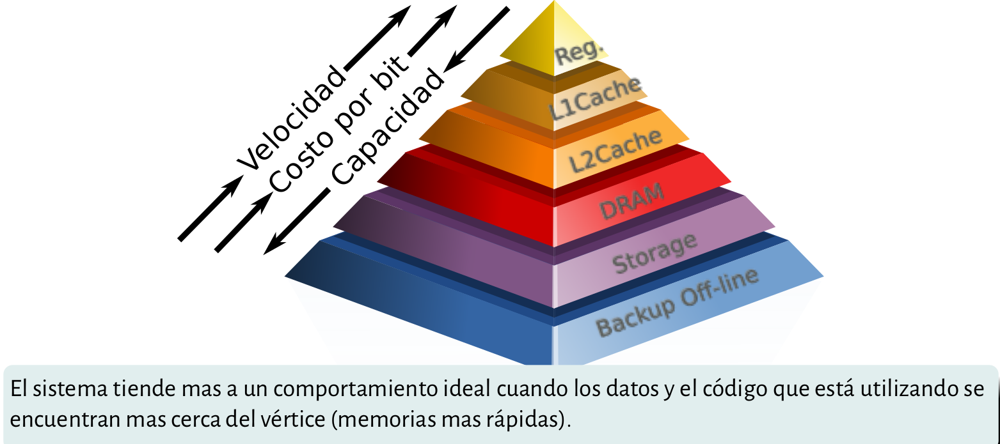

---
# Tecnología de Memoria

## Memorias No Volátiles
Son dispositivos capaces de retener la información almacenada cuando se les desconecta la alimentación, pueden modificarse en tiempo real, es anacrónica la denominación ROM. EJ: SSD, Pen drive y tarjetas SD. En ellas se almacena el **programa de arranque**

## Memoria Volátiles
Si son interrumpida la alimentación se pierde la información, conocidas como RAM debido a que su tiempo de acceso es siempre el mismo (independiente la ubicación en la memoria). Tienen mayor capacidad que las no volátiles y se pueden modificar en tiempo real. Se subdividen en
- DRAM
- SRAM

### **DRAM**
Almacena la información de estado de carga de un capacitor y la sostiene durante un **breve** lapso con la ayuda de un transistor, una celda con un solo transistor, consume minima energía y es barata. Necesita mantener el estado de carga y además al momento de leer se necesita recargar la carga (lectura destructiva), aumenta el tiempo total que demanda el acceso de la celda, además se descarga lentamente el capacitor, con lo cual se debe recargar recurrentemente

### **SRAM**
Es mucho más rápida (latch), es muy estable, pero es costosa (6 transistores por bit) y el costo es más alto.

Al ser más rápido el procesador se introduce los *Wait States* en cada ciclo de acceso de memoria, para la espera, luego en modo *READY* se podía hacer el acceso. Necesitamos minimizar esto, qué RAM ponemos?

---
# Caché
 Esta memoria ocupa el primer nivel de jerarquía, es una SRAM de muy bajo tiempo de acceso, mantiene una **copia** de los datos e instrucciones que se está utilizando, o cuya probabilidad de ser usados es alta (Principio de localidad), por lo tanto el principal uso de las SRAM son las caché.

## Métricas

Debe ser lo,
- suficientemente grande para que resuelva la mayor cantidad posible de búsquedas de código/datos
- suficientemente pequeña para no afectar consumo y costo del sistema

*Hit:* Acceso a un ítem que se encuentra en cache
*Miss:* Acceso a un ítem que no se encuentra en cache
Queremos maximizar el *Hit rate*

La caché se administra por bloques o líneas, basado el principio de vecindad (trae los vecinos para aprovechar el bus -estos son muy grandes-). Si **no** está en el caché el tiempo de recupero del ítem dependerá del *latency* y del *bandwidth* de la memoria con que esté implementado ese nivel de jerarquía.

- *Latency:* Tiempo en traer desde la CPU la primer palabra de la línea
- *Bandwidth:* Tiempo adicionar para traer al cache el resto de las palabras que caben dentro de la línea.

Si el procesador ejecuta en orden --> Memory stall
Sino, puede seguir con otras instrucciones

La memoria principal normalmente está administrada por bloques llamados páginas, en caso de que no esté en una página de la memoria principal, habrá que buscar a disco, traerla a la memoria física y luego traerla a CPU, no podemos saber a priori en que nivel de la jerarquía está el dato.

## Hardware dedicado
Se agrega un controlador cache que está entre el procesador y el bus del sistema, intermedia. Las líneas del bus de control son las que indican al exterior qué operación está iniciando el procesador hacia el sistema, son las que arbitran (las líneas de control), el controlador cache las toma y se convierte en el acto en el árbitro del bus, el controlador caché es árbitro de bus. Este lee el address solicitado y qué se está haciendo (control), este determina si ir al bus de sistema o la cache. Se compone de la siguiente manera,

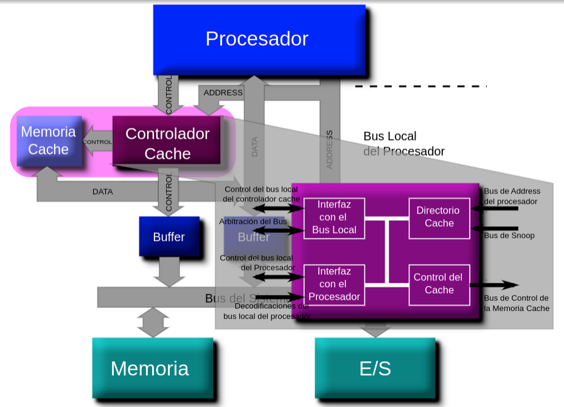

## Organización de una Cache

La unidad mínima son las líneas (cada una es un conjunto de bytes) que están en una zona de la memoria (generalmente principal), la línea comienza en dirección física múltiplo al tamaño de la línea (como pequeñas páginas), cada línea lleva asociado un tag que indica a que dirección de memoria corresponde (los bits más significativos para saber en qué dirección inicia).

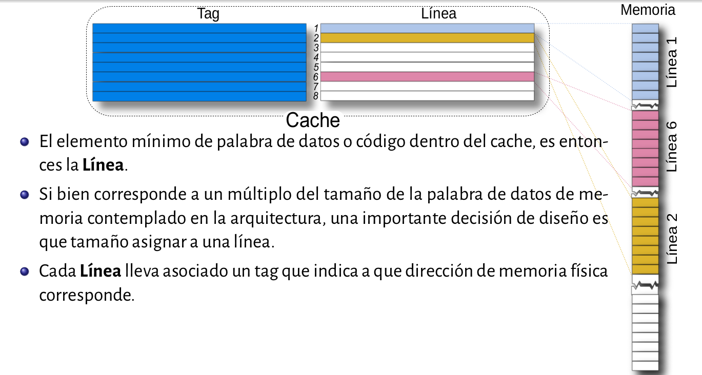

La organización de un cash requiere contemplar 4 factores en función de las operaciones que requiere la CPU
- Line placement
	- Donde poner una linea de memoria en el cache
- Line Identification
	- Ya ubicada, cómo la identifico
- Line Replacement
	- Mecanismo de reemplazo de lineas existentes en respuesta a un Miss
- Write policies
	- Manejo de escrituras

### **Line placement**
Para leer una dirección se hace $direccion / Line Size$ y se toma parte entera, dónde iría en el cache?
- Fully associative, en cualquier lugar de líneas libres
	- Máximo hit rate, y facilita el uso de varios algoritmos de reemplazo ✅
	- Iterar sobre la cache, aumentando consumo y/o tiempo ❌
- Direct mapped, único lugar donde poner la línea (mediante  LineFrameAddres $mod$ LineSize)
	- Simplifica al máximo el placement y búsqueda, es la más barata en término energéticos ✅
	- Peor hit rate, dos lineas frecuentemente usadas que ocupen el mismo lugar se desalojan entre sí, **conflict miss** ❌
	- 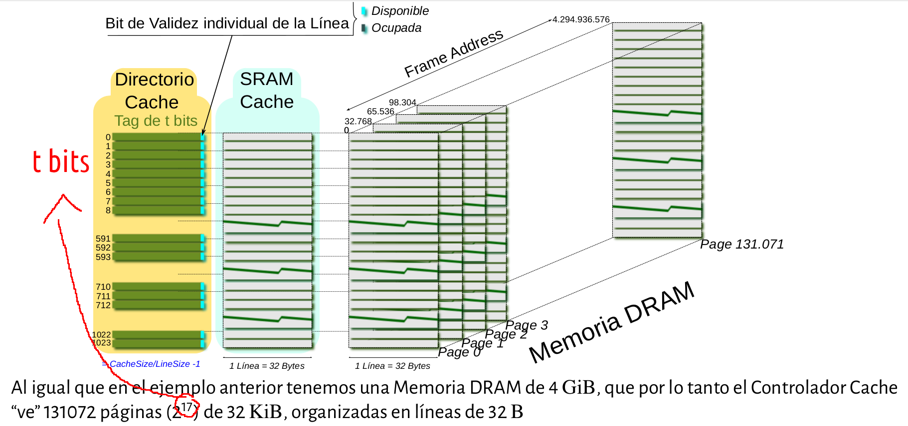
- Set associative, grupo de lineas en el cache en las que se puede guardar la nueva linea, LineFrameAddres $mod$ # sets
	- Mejor relación de compromiso ✅
	- Puede tener **conflict miss** ❌
	- Se quiere disminuir el conflict miss, el controlador cache modifica la forma de organizar la memoria cache y la forma en la que esta mapea en la principal, la cache ahora se organiza en bancos (o vías). La memoria principal se trata (como antes) en conjunto de páginas pero el tamaño de cada uno será al de el tamaño de vía.
	- 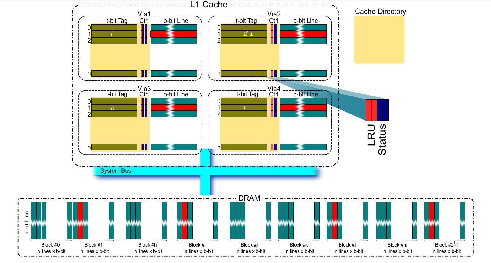

### **Line identification**

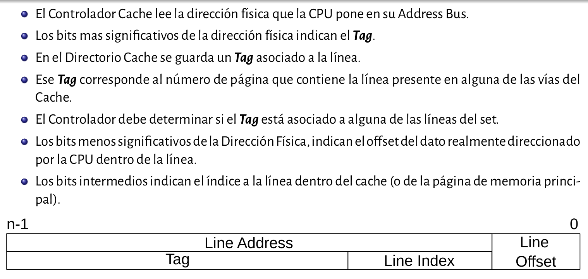

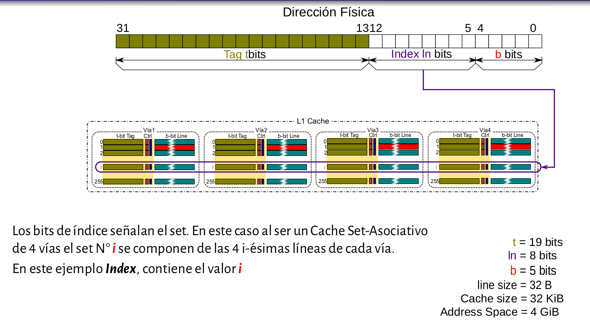
### **Line Replacement**

Generalmente son tipo Set-asociativas, en este punto tenemos que resolver cual de las $n$ vías desalojar cuando hay **Conflict Miss**
- Random: Aleatoria (una de las $n$ veces)
	- Fácil de construir ✅
- LRU: Least Recently Used
	- Costosa en hardware ❌
	- Se puede aproximar un campo de bits del cada set del cache cada bit correspondiente a una vía, cuando todos se activan se resetean todos excepto el más recientemente usado, así cuando se va a reemplazar se va por el/los reseteados
- FIFO: Pseudo-LRU

### **Write policies**
La mayoría de accesos son lecturas. En cambio para escribir se necesita saber si es un hit, estas deben modificar una parte la línea (no toda), hay dos opciones principales
- Write through: el dato se escribe en el Cache y en el nivel inferior de la jerarquía
	- ✅ 
		- Implementación más simple
		- El inferior siempre tiene copia coherente del dato
- Write back: (Copy back) el dato se escribe solo en el cache y se actualiza en el resto de la jerarquía solo cuando es desalojado.
	- Para minimizar los write backs se usa un bit (*Dirty*) que indica si tal linea fue modificada, por lo tanto el copy back solo es necesario para lineas cuyo bit *dirty* esté activado.
	- ✅ 
		- Escrituras a velocidad de cache
		- Si hay multiples escrituras en una linea solo una escritura se enviará hacia el nivel inferior
		- Demanda menos ancho de banda en el bus

*Write stall:* Espera del procesador una escritura que debe replicarse en niveles inferiores de la memoria, se puede agregar un *Write Buffer* en el controlador cache, las escrituras se almacenan a dicho buffer y en el cache, en paralelo se actualiza la copia en el nivel inferior de la jerarquía mientras el procesador hace otras instrucciones, ❌ Si hay un Read Miss, el Miss Penalty es mayor ya que deberá esperar a que termine la actualización .

**Write miss**, hay dos formas de tratarlo
- Write allocate: Actúa como Read Miss, se lee la línea del cache y luego se escribe
- No-Write Allocate: La operación no afecta el cache, el dato escribe en el nivel inferior inmediato, solo se usa el cache cuando se necesita leer.

**Obs:** Si una CPU necesita buscar más instrucciones y al mismo tiempo resolver un Load/Store con memoria (tenemos un bottleneck), se usa dos Cache separados para código y datos (*Split Cache*)

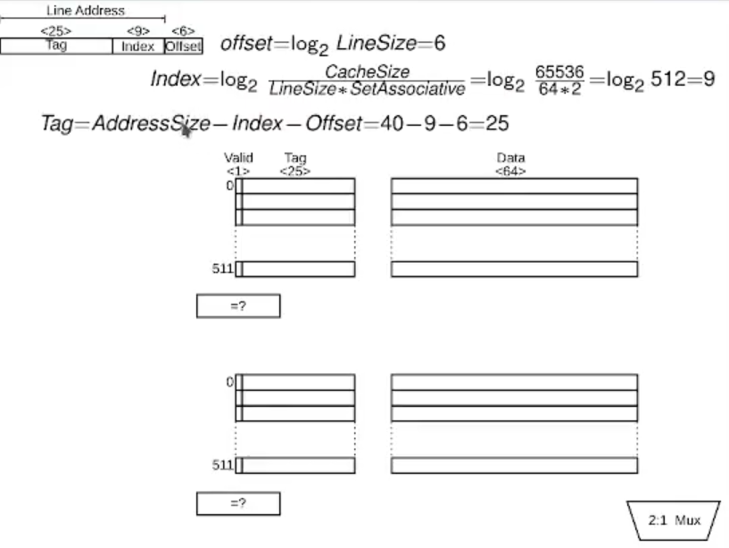

## Cache en Sistemas Multiprocesador

**Sistema SMP** (Symmetrical Multi Processing): dos o más CPUs (idénticas con igual prioridad), para cada par de CPU - Cache System en un mismo Circuito Integrado, se denomina Core.
*img*

Todos los cores tienen mismo latency para acceder a memoria, si aumentan el numero de cores requiere más ancho de banda para la DRAM, por lo que surgen los **Distributed Shared Memory** system, la memoria está distribuida por grupos de cores se accede a la local y la del resto.
*img*

Volviendo a la cache....

Cuando escribimos en el cache del procesador y queda diferente de las copias de la jerarquía, desde el nivel inferior hasta la DRAM, la estrategia para mantener coherencia depende de varios factores, uno de ellos el número de CPUs del sistema. 

Si el sistema es SMP, y se ejecuta paralelismo estos se ejecutan en varias CPU al mismo tiempo, eventualmente pueden existir copias de una misma variable en uno o más Cache de los restantes Cores, con lo cual las copias también quedan obsoletas -coherencia horizontal, resto de las cache-, debemos hallar una manera de que los demás Cores se enteren del cambio, para al menor invalidar la línea para saber que es obsoleta.

❗ **Objetivo**: Asegurar coherencia para los datos compartidos en los diferentes Sistemas Cache sin sacrificar performance.

Un **Sistema de Coherencia de Caches** debe proporcionar (para los item compartidos)
- Migración: ocurre cuando un ítem se mueve a un cache de manera transparente
- Replicado: cuando un dato se mueve a un cache en un sistema SMP, el sistema debe proporcionar Replicado si más de un Core requiere leer el dato de manera simultanea (evitar contención de Bus)

En los SMP se implementan por hardware, **protocolos de coherencia**, dos clases

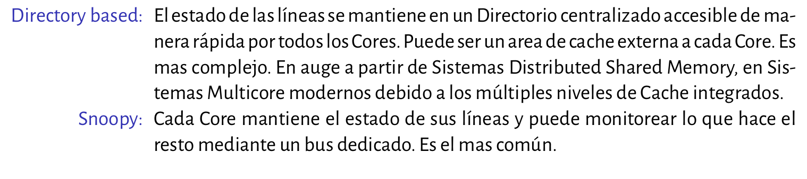

Dos categorías (sobre los que usan ==snoop bus==),
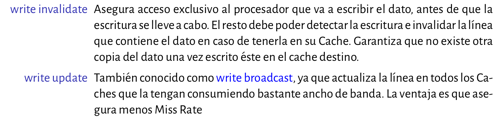

❕Mucho más usado el snoopy
❕*write invalidate* más usado (debido a que generalmente un número importante de procesadores)
### **Snoop Bus**

El snoop bus se conecta desde el bus de sistema a cada controlador cache (uno por cada), este "espía" lo que hacen los demás procesadores al leer la dirección   (del bus de sistema) y la acción requerida (desde el bus de control), si es un hit se resuelve desde el que la detectó y activa el protocolo de coherencia, sino sigue en su proceso normal.

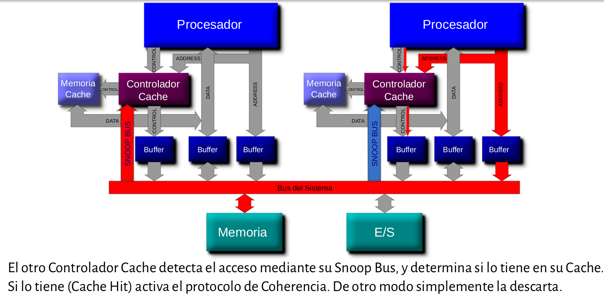

### **Write Invalidate**
- Cuando se produce una escritura en una línea compartida, el procesador que escribe debe tener acceso exclusivo al bus para colocar la dirección que los demás deben ==invalidar== una vez leída desde su *Snoop Bus*.

- Y la arbitración? Serialización, lo que conlleva a que una escritura en un elemento de datos compartido no se puede completar hasta que se acceda al bus

- Búsqueda: Se debe localizar un item cuando hay un Miss
	- Si es *write-through:* todas las líneas se envían a memoria siempre, por lo que se puede obtener el valor más reciente de un elemento en cualquier lugar de la jerarquía (los buffers de escritura pueden tener el dato modificado esperando a ser copiado "hacia abajo")
	- Si es *write-back:* el valor más reciente puede estar en cache privado, en vez de compartido, o en la memoria principal, por eso los *write-back* usan Snooping para Miss y escritura. ❓
	- Los procesadores multicore usan **write-back** en los niveles más externos de cache, los analizaremos como mantienen la coherencia

- Escritura: 
	- Si no hay copias de la línea en las otras cache no hay que enviar nada al bus, para ello se agrega un estado (bit) **owner** la cual indica si el Cache actual es el único que contiene la línea (a tal cache se le llama **owner**)
	- En caso de que otro procesador la necesite vuelve a ser compartida, tal Cache Miss se va por el bus proveniente del procesador remoto y se detecta por el Snoop Bus el acceso a memoria (hay optimizaciones)

Copy Back es el método menos demandante del bus del sistema optimizado su uso, para poder utilizar este método de escritura siempre que sea posible (reemplazarlo solo cuando la misma dirección física está presente en por lo menos dos cache) se han desarrollado **protocolos de coherencia**

### **Protocolos de coherencia** 

Maquina de estados finita en el Controlador Cache de cada core, que cambia el estado de la línea de acuerdo con requerimientos del,
- procesador local del core
- bus
Debe definir dos atributos para una línea de un Cache
- ownership
- coherencia

$Defs$ 
- Un cache es propietario de la línea cuando es el único que lo tiene, sino es ***shared***.
- Una línea puede estar coherente con el resto de las copias disponibles en el sistema cuando todas las copias son iguales.
- Una linea está incoherente si su copia está Dirty (***Modified***) en algún cache producto de alguna escritura. Esto último implica que se ha perdido la coherencia. Puede tolerarse esta situación siempre que el cache que tiene la copia ***Modified***, tenga el *Ownership* de la lı́nea.

### **Implementación de protocolos de coherencia**
#### ***MSI***

- Invalid: Es una línea que no está disponible
- Shared es impreciso, porque cuando se invalida no lo informan a los demás, por lo que una línea que está compartida en varios core, en algún momento puede haber sido descartada por todos los core excepto uno, el cual no se ha enterado (asume compartida), ventaja permite **write-back** (al usar write-invalid)
- Veremos los requerimientos de la CPU local 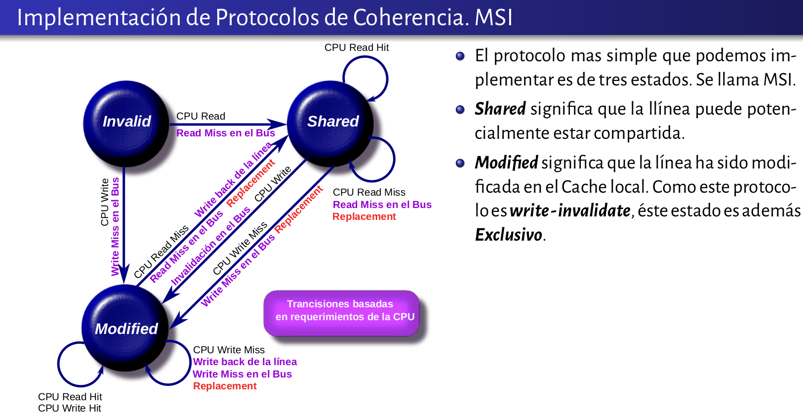

- De acuerdo a los requerimientos del snoop bus,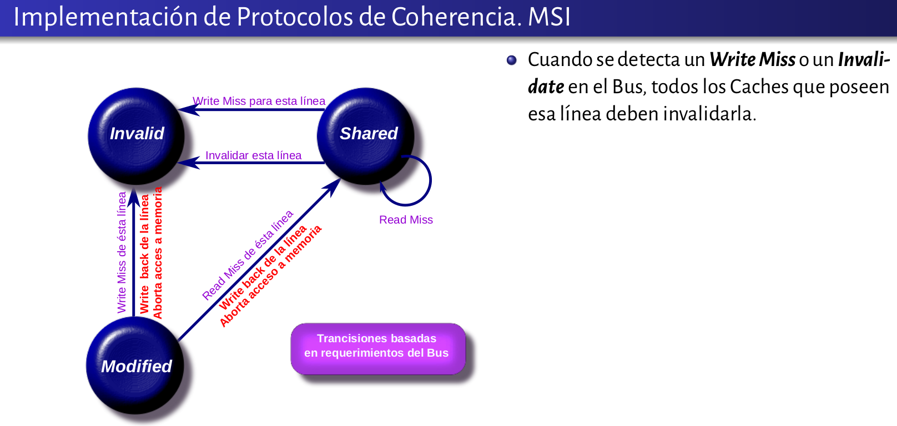
- ❌ Al ser tan impreciso shared, hay varias innecesarias (por las dudas de que alguien más tenga la línea)

#### ***MESI***

- Se agrega el estado Exclusive para disminuir la actividad en el Bus: una línea en estado **E** puede escribirse sin invalidar sobre el bus
	- **M - Modified** Lı́nea presente solamente en éste cache que varió respecto de su valor en memoria del sistema (dirty). Requiere write back hacia la memoria del sistema antes que otro procesador lea desde allí el dato (que ya no es válido).
	- **E – Exclusive** Lı́nea presente solo en esta cache, que coincide con la copia en memoria principal (clean).
	- **S – Shared** Lı́nea del cache presente y *puede* estar almacenada en los caches de otros procesadores.
	- **I – Invalid** Lı́nea de cache no es válida.
- Una de las grandes mejores es la de, cuando una línea está en **Exclusive** y recibe un CPU Write, la misma pasa a estado modified y **NO** invalida el bus (ya que era el único que la tenía)
- 
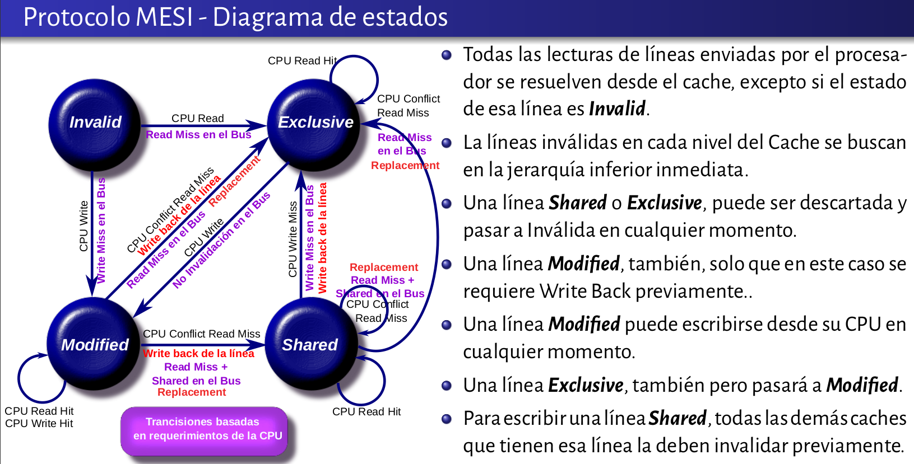

Se agrega RFO (*Request For Ownership*), el cual estará conectado entre todos los cache controllers. Para qué? El broadcast de invalidación usa esta línea, es enviada por el Cache que necesita escribir en estado Shared o Invalid (para que todos invaliden)
- Modified y Exclusive son estados **precisos**, el protocolo asegura que una línea en cualquiera de estos estados solo está en este cache (**Ownership**)

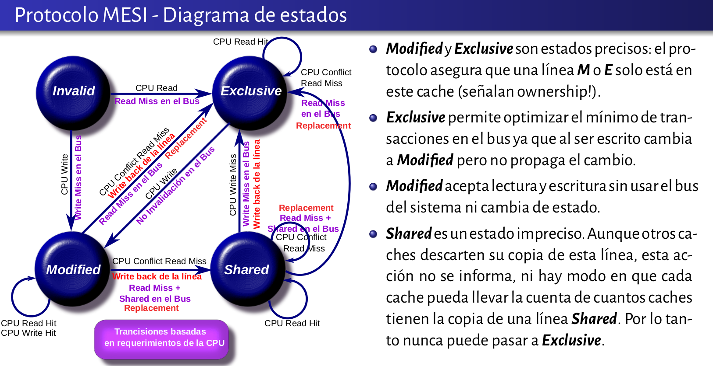

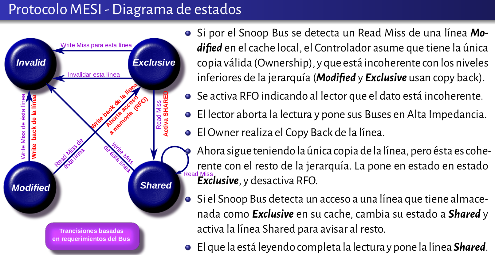

Se agrega una línea SHARED la cual se usará para os cores se informan, si un core tiene una linea E mira por el snoop bus y ve que se va a leer esa línea, activa shared para que el otro core que la está leyendo no la ponga *exclusive* sino *shared*.

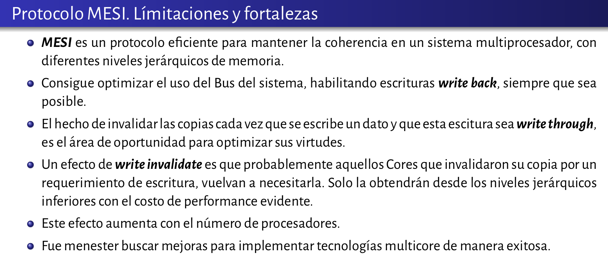

###### Tabla de estados de una cache que requiere el dato dió un Miss

| Otra cache tiene la línea en | Read Miss                                                                                                                                                                                                                                                                                     | Write Miss                                                                                                                                                                                                                                                                                                                                                         |
| ---------------------------- | --------------------------------------------------------------------------------------------------------------------------------------------------------------------------------------------------------------------------------------------------------------------------------------------- | ------------------------------------------------------------------------------------------------------------------------------------------------------------------------------------------------------------------------------------------------------------------------------------------------------------------------------------------------------------------ |
| Exclusive                    | SHARED señal al lector  indicando que es  compartida. En **ambos**  esa línea se marca como **Shared** (es necesaria la primera señal para que se entere el lector que la  línea es compartida o exclusiva)                                                                       | El escritor trae la línea enviando RFO (clean) para que mi copia pase a estado **Invalid**, el escritor pasa a **Modified**                                                                                                                                                                                                                                        |
| Shared                       | Si uno o más tienen la copia (clean), se envia la señal SHARED y el lector la marca como **Shared**                                                                                                                                                                                           | El escritor trae la línea de memoria y la modifica, envía RFO (clean) para que mi copia pase a estado **Invalid**, el escritor pasa a **Modified**                                                                                                                                                                                                                 |
| Modified                     | 1. Activa RFO para marcar al lector que el dato está incoherente (bus alta impedancia) 2. Escribe en memoria el valor 3. El lector copia el valor que está en el bus de datos y pasa a **Exclusive** 4. Si el otro termina la operación entonces ambas terminan en estado **Shared** | Se debe avisar al escritor que la copia está desactualizada y el es el owner, por lo tanto 1. Marcar RFO para indicarle lo anteriormente dicho al escritor 2. **Invalid** mi copia del valor ya que el escritor lo modificará 3. Escritor copia el valor ya actualizado desde el bus de datos 4. El escritor modifica su valor y se marca **Modified** |
| Ninguna /Invalid          | El lector lee desde memoria y se marca como **Exclusive**                                                                                                                                                                                                                                     | El escritor trae la línea de memoria y pasa a **Modified**                                                                                                                                                                                                                                                                                                         |
**Read hit:** No importa el estado en el que esté simplemente la cache lee el valor y se queda en el **mismo** estado

###### Tabla de estados de una cache que efectivamente tiene el dato requerido y lo escribe

| El Cache tiene la linea en | Write Hit                                                                                                                                   |
| -------------------------- | ------------------------------------------------------------------------------------------------------------------------------------------- |
| Exclusive                  | Ya es Owner de la línea pasa a **Modified** *(esta es la gran ventaja de MESI, no tiene que usar el bus)*                                   |
| Shared                     | Se debe tener Ownership para escribir así que envía RFO para que marquen **Invalid** sus copias. Y el cache que escribe pasa a **Modified** |
| Modified                   | Escribe, y sigue en **Modified**                                                                                                            |

#### ***MESIF***

Optimiza el acceso al Bus en sistemas de memoria distribuida (agrega el estado **FORWARD**, forma especial de estado SHARED)

- El protocolo debe asegurar que entre los caches que tienen  una linea en estado **S**, ***una*** de ellas tenga estado **F**, la invalidación de una línea F y S no se informa, el próximo *Read miss* será resuelto por jerarquía (ver ❌)
- Cómo funciona? Si se tiene **shared** en **MESI** y se quiere leer (Read Miss) tiene que buscar en la memoria principal (❓ - Por qué???), el forward significa que el core que tenga estado F es quien proveerá la línea (es shared forwardeable), una vez que la línea está shared, la línea se accede desde algún cache, ✅ no se penaliza un Read Miss en un core
- ❌ SI la linea F es desalojada. Para minimizar este efecto se asigna el estado **F** mediante LRU. Cuando forwardeo, quién lo obtuvo queda en **Forward**

#### ***MOESI***
- Se le agrega **Owned**
- **Shared** indica que esta copia de la lı́nea puede estar en otros Caches (sigue siendo impreciso), y es válida (es la copia mas reciente de la lı́nea). Hasta aquí es **igual que en MESI**
- Pero a diferencia de MESI, ==la copia en memoria principal puede ahora no ser válida.==
- Si ningún Cache tiene una copia de esa misma lı́nea en estado Owned, la copia de memoria principal es válida. Sino...no. **Y aquí reside la diferencia.**
- Solo una copia de la línea tiene el estado **Owned**
- Esta será la único que puede escribirla sin hacer **write back**
- El resto de las copias compartidas están en **S** y válidas
- Si escribimos en **Owned** se activa transacción por Bus local y se actualizan los demás caches que tiene la línea en **S**
- ✅ Disminuyen los **write back** por intentar leer línea *Dirty*, y  las invalidaciones al escribir en **Shared**
- ❕**Owned** le proveerá a "nuevos lectores" (como un forward)
- En caso de que nadie tenga la línea se busca en jerarquía

---
# Memorias dinámicas

*Nota:* Generalmente están fuera del chip de la CPU (al contrario que las cache)

Características de diseño
- Pines: No solo el input sino características eléctricas
- Señalización: Handshake con el hardware controlador
- Signal Integrity: En función de freuencia de trabajo
- Encapsulado: Define la manufacturabilidad
- Clock y sincro: Montaje en el PCB y adaptaciones eléctricas al bus
- Timing: Refresco, tiempo de acceso para w/r.

Para la interacción entre la CPU y los chip/s de DRAM está un controlador de memoria dinámica.

### **Sobre las celdas,**

- Desde el punto de vista eléctrico leer un bit no resulta trivial.
- Hay que poder sensar el estado de carga durante un intervalo muy pequeño de tiempo ya que una vez cedida en forma de corriente eléctrica si no logra detectarse, la carga se habrá perdido irremediablemente y con ella el estado lógico de la celda.
- Para ello los conductores que transportan la señal se precargan en un estado intermedio entre ’0’ y ’1’.
- La carga de la capacidad de entrada del transistor desbalancea ese estado de precarga en mas o en menos.
- Por medio de amplificadores de detección se detecta el desbalance “empujando” la celda al estado
lógico inicial.

### **Organización**

Matriz rectangular de celdas, con decodificador de columna y uno de fila, 
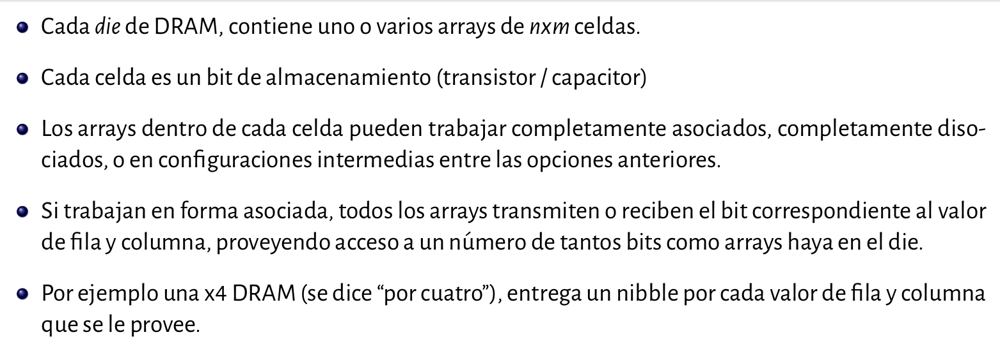

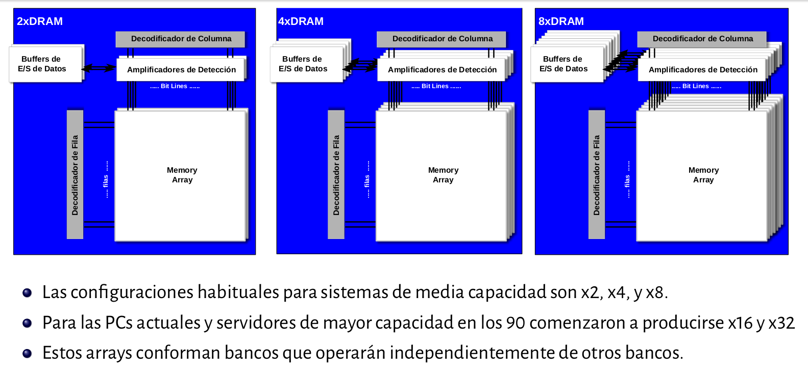

Bancos,

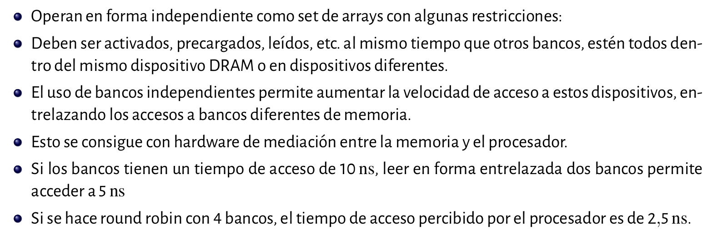

### *DIMM*

Se organizan en DIMMs se montan a ambos lados del PCB, cada uno se puede pensar como un banco independiente, o bien, cada dispositivo o grupo DRAM de un DIMM se puede asignar a un banco independiente

**Rank:** Set de dispositivos DRAM (todos los de un DIMM o una parte de ellos) que operan en forma conjunta

**Banco:** Cada dispositivo DRAM implementa internamente uno o mas bancos independientes que operan de forma independiente entre sı́.

**Array:** Cada banco de un dispositivo DRAM se compone de un conjunto de arrays esclavos, cuyo número determina el ancho del dispositivo DRAM (x2,x4, etc).

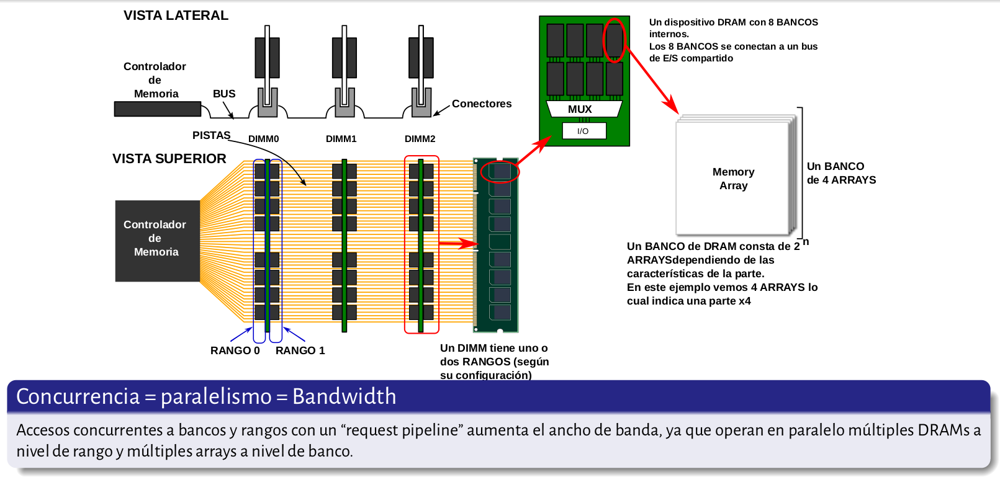

### **Standards**

Ahora se usan las SDRAM, el modo burst es consecuencia del principio de vecindad (ráfagas)

Estándar: JEDEC

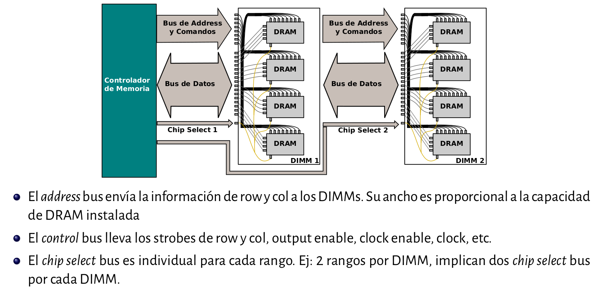

### **Controladores de memoria**

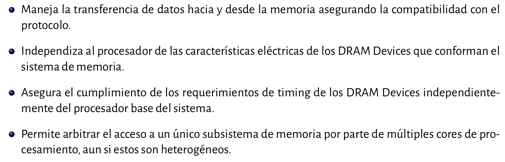

### **Configuración de DRAM**

Registro de modo de un SDRAM Device

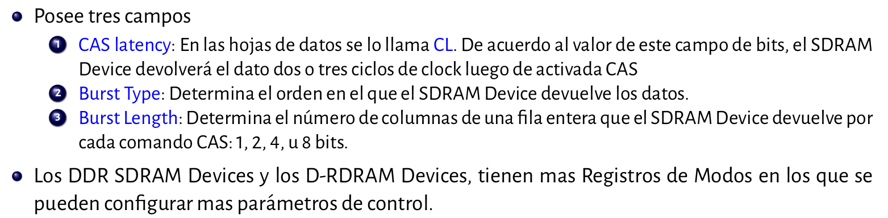

#university #computer_architecture #hardware 
