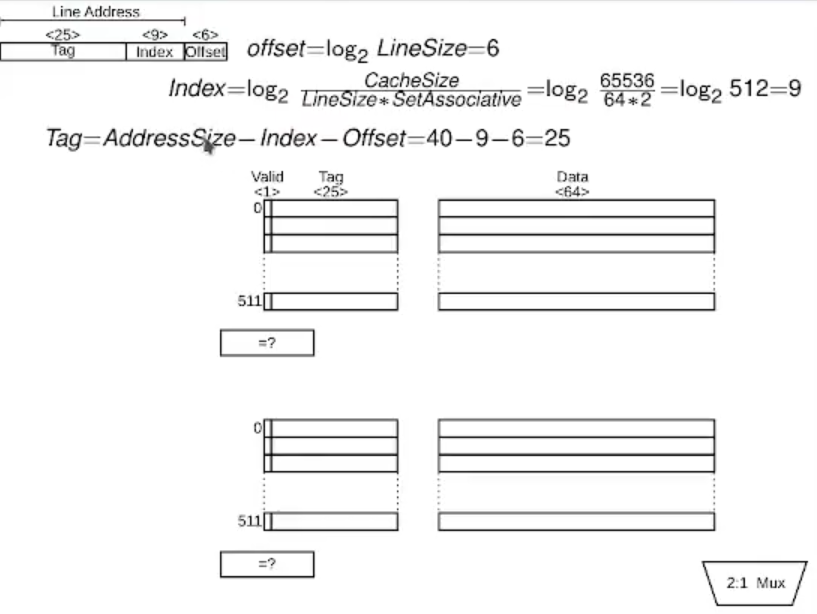

Se describirá cómo calcular el tamaño de los aspectos relevantes de una memoria cache

Recordemos que los últimos bits son el offset dentro de la línea de cache a la cual se direcciona por la CPU

$$
\text{offset =} \log_{2}\text{LineSize}
$$
Los bits intermedios son el índice a la línea dentro del cache (o página de memoria)
$$
\text{index} = \log_{2}\left( \frac{\text{CacheSize}}{\text{LineSize * SetAssociative}} \right)
$$
Por último el tag es el que indica el número de página que contiene la línea 
$$
\text{tag} = \text{AddressSize} - \text{Index} - \text{Offset}
$$

