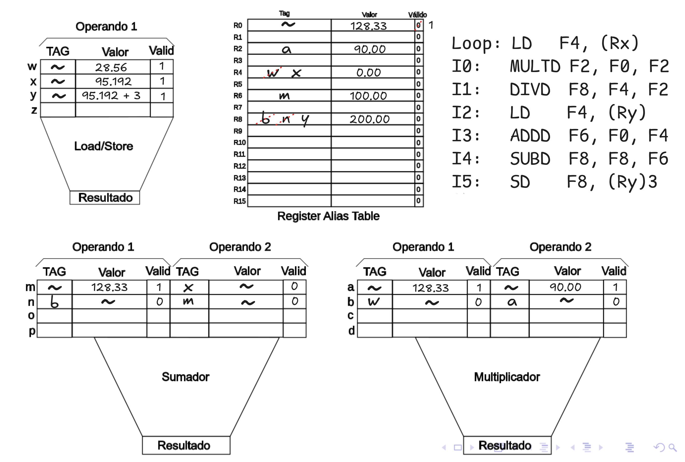

1. Sistema tiene cache L1 de datos con las características:
	- Memoria cache asociativo a línea (no sets) de 4 vías y 32 KiB de tamaño. Line Size = 32 bytes, Address Bus Size: 40 Bits
	- Determinar los siguientes parámetros del Directorio Cache
		- a) Tag Size
		- b) # Sets
		- c) Formato de una entrada del Directorio Cache
		- d) # Total de Entradas del directorio cache
		- e) # Líneas por tag

**b)** Uso la fórmula $$\text{sets} =  \frac{\text{CacheSize}}{\text{LineSize * SetAssociative}}$$
Por lo tanto tengo 32,768/32 x 4 = 256

**a)** Ahora uso la fórmula $$\text{tag} = \text{AddressSize} - \text{Index} - \text{Offset}$$
Index es simplemente tomar $\log_{2}$ a la cantidad de sets, por lo tanto sería 8 y el offset es tomar $\log_{2}$ al LineSize, por lo tanto es 5, así 40 - 8 - 5 = 27 bits

**c)** Tengo el tag (27) además de los bits LRU (2) y el de validez (1) (igualmente esto depende de la implementación, ej copy-back necesita bit *Dirty*)

**d)**  $$\text{Total Entradas} = \text{Sets} \times \text{Vías}$$
Esto es 256 x 4 = 1024 entradas

e) cada bloque es de 8 kb, dividido 32 bits por linea da 256 lineas por bloque, cada bloque es identificado por un único tag así que 256 lineas por tag ❓-> Fuente telegram

---
2. Se tiene un sistema SMP. Cada procesador tiene su propio controlador Cache. Utiliza para mantener coherente los subsistemas de memoria cache y la DRAM el protocolo MESI
	- a) Cuál es el recurso de hardware mediante el cual cada Controlador Cache detecta las transacciones que los demás Cores cursan con la memoria del sistema (DRAM)?
		- Snoop bus, el mismo es un bus que se conecta desde el bus del sistema y cada controlador cache, este mismo toma las líneas de control y la de address, así detecta acciones que hayan hecho miss en el cache que hizo la request
	- b) Explicar si M es un estado preciso o impreciso. Justificar
		- Modified es preciso debido a que la copia en el cache es la versión reciente del dato y la copia correcta del mismo, además se tiene la certeza de que el cache tiene la única copia del dato que es correcta (Owner)
	- c) En caso de que otro procesador inicie una transferencia de lectura sobre un dato que pertenece a una línea, cuyo estado es M, se desea saber:
		1. Están coherentes las diferentes copias del dato requerido?
			- No, la que tiene la línea en estado M tiene la versión correcta del mismo
		2. Cómo se asegura la coherencia de la operación?
			-  La línea que tiene la línea en modified inicia RFO (request for ownership), para marcar que la línea está incoherente
			-  Hace write-back de esta línea y el cache que requiere la línea toma su valor desde el bus, y la misma pasa a **Exclusive**
			- Si terminan la operación ambas pasarán a **Shared**
		3. Cuál es la política de escritura aplicada por el procesador antes de la transacción analizada y después de la misma?
			- Se usa **Write-Back**: Las modificaciones ocurren en la caché sin actualizar la memoria principal de inmediato.
			- Se aplica **Write-Invalidate**: La caché que tenía la línea en estado **M** realiza un **write-back** a memoria (o al bus) para asegurar que el dato más reciente esté disponible.
---
3. Represente el código ubicando los valores apropiados en el modelo de Tomasulo. Condiciones iniciales: Rx=0x4FF09E1C, (Rx) = 28.56, Ry=0x3ECA0098, (Ry) = 95.192, F0 = 128.33, F2=90.00, F4=0.0, F6=100.00, F8=200.00

Los valores de los registros deberían ir a la RAT con tag  ~ y válidos todos (en específico, R0, R2, R4, R6), para claridad del diagrama omito estas condiciones iniciales en el mismo y actualizo los valores desde la primera línea de código, notar que R0 nunca fue escrito por lo que efectivamente queda el valor dadas por las condiciones iniciales.
 
 