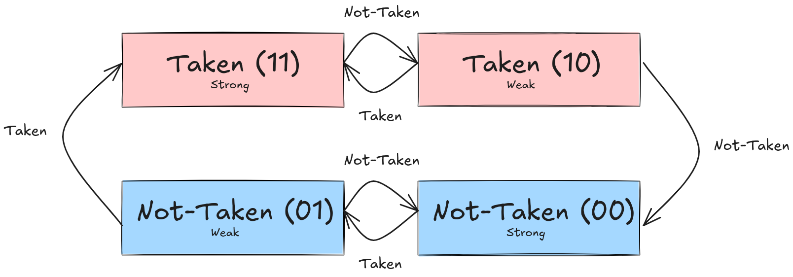

1. Ejecución Fuera de Orden. Concepto y funcionamiento generales. Ventajas respecto de un approach superescalar en orden. Considerar para la comparación que ambos modelos tienen la misma cantidad de vías de ejecución.
	- Se utiliza para ahorrar ciclos de clock, al tratar de enviar las instrucciones a ejecución independientemente del *orden* que están, nuestro decodificador nos indicará si se presenta algún atasco dónde podemos intentar aplicar este método. Recordar que, la aplicación de los resultados va en orden, sino, estaríamos cambiando completamente la lógica del programa. Las ventajas de este mecanismo es la eficiencia a la hora de los stalls, por ejemplo los tiempos de espera de memoria, mientras el dato se lee/escribe se ejecutan múltiples instrucciones, por otro lado si hay dependencias se pueden ejecutar otras instrucciones mientras se resuelve la misma
---
2. Explicar el algoritmo de Tomasulo. ¿Cuáles son los riesgos que resuelve? Explicar cuales son los bloques de hardware que se agregan a un procesador superescalar y como funciona cada uno.
	- La idea de Tomasulo se basa en renombrar los registros para solucionar dependencias (toma cada registro físico y le asigna un tag -la estructura que los relaciona se la conoce como Register Alias Table (RAT)) y luego usar dichos renombres en otra estructura llamada Reservation Stations (RS), la cual tiene la instrucción a ejecutar (que aún no tenga los operandos listos) y un lugar para los operandos, dicha instrucción no se envía a ejecución hasta que ambos operandos estén listos, cuando una operación se completa el Common Data Bus (CDB) se usa para broadcastear el valor a todas las RS que tienen dicho tag esperando por valor, cuando los valores de los registros son válidos (es decir no necesitan ser producidos) el tag se torna irrelevante
	- Notar que los renombres eliminan las hazards tipo WAW y WAR al no cruzarse los registros y al usar el tag para esperar los valores producidos
	- Y la parte de la RS hace que las instrucciones tengan que esperar a la producción de sus operandos, así no usa valores que no son válidos aún, minimizando los RAW, ya que al broadcastear el valor puede ejecutar la operación sin esperar que la escritura se complete
	- Tomasulo soluciona los riesgos WAW y WAR, mientras que los riesgos RAW son minimizados, ya que si una instrucción tarda mucho más que la posterior y la posterior necesita un dato escrito por la que tarda es obligatorio que tenga que esperar para ejecutar dicha instrucción
	- Las estructuras agregadas son:
		- Register Alias Table
		- Reservation Station
		- Common Data Bus
---
3. Predictor de saltos de 2 bits. Motivación y funcionamiento. ¿Qué limitación resuelve respecto del Predictor de 1 bit?
	- El predictor de dos bits es una extensión del predictor de 1 bit, el cual determina si predecir la toma del branch o no (se suelen llamar taken o not-taken), la diferencia radica en la flexibilidad adicional del de 2 bits, ya que el primero siempre toma la decisión (de predicción) según el salto anterior (dado que si fue taken se pondrá 1 sino 0), al agregar un bit más tenemos que el predictor tiene cierta tolerancia respecto a la predicción, por lo que situaciones como loops anidados pueden tener mayor accuracy o situaciones TNTNTNT, el de dos bits tiene un accuraccy de 50% mientras que el de 1 bit 0%.
---
4. Explicar las diferentes políticas de escritura de un sistema de memoria compuesto por un cache de datos de L1 y un subsistema de Memoria Dinámica, y su relación con la coherencia entre ambos datos.
	- Existen 2 tipos de escrituras 
		- Write-Through: Esta política tiene como característica principal que mantiene siempre *coherente* el cache con la memoria principal por lo que el dato que se encuentre en la cache siempre coincidirá con el de la memoria, esto implica que cada escritura que se haga sobre una línea del cache tiene que también escribirse (y bajar en la jerarquía) a la memoria, lo que hace que el bus esté siendo accedido y ocupado mucho tiempo
		- Write-Back (copy-back): Esta política tiene como característica principal que mantiene los datos escritos en la memoria cache hasta que la línea tenga que ser *desalojada*, en ese momento hace la escritura al nivel inferior de la jerarquía, lo que hace que programas que requieran gran cantidad de escritura no estén accediendo al bus en todo momento (también se implementa en la línea cache el bit de dirty para saber si la línea fue modificada en el cache, en el que caso de que no lo sea no es necesaria la escritura a memoria), notar que este tipo de escrituras son muy rápidas (a velocidad cache)
---
5. ¿Cuál es mas apto para un sistema Monoprocesador y cuál para un sistema SMP? Justificar
	- En sistemas monoprocesador es más apto Write-Through por su implementación más simple y el bus que conecta el nivel de cache con la siguiente jerarquía solo será ocupado por tal procesador
	- Mientras que en sistemas SMP si usáramos Write-Through habría multiples accesos al bus de memoria, por lo que habría mucha latencia a la hora de escribir un valor, para ello se usa write-back (copy back) utilizando un protocolo de coherencia (tales como MESI, MESIF, MOESI)
---
6. Qué entiende por snooping y con qué elementos circuitales se implementa? ¿Cómo se complementa con el protocolo MESI?
	- Es un mecanismo para implementar protocolos de coherencia en sistemas SMP, la idea principal es que haya un bus que "espie" los demás caches, dicho snoop bus se conecta desde el bus de sistema a cada controlador cache (uno por cada), este "espía" lo que hacen los demás procesadores al leer la dirección (del bus de sistema) y la acción requerida (desde el bus de control), si es un hit se resuelve desde el que la detectó y activa el protocolo de coherencia, sino sigue en su proceso normal.
	- 
	- Notar que también debemos tener los controladores cache y los directorios de estado de cada línea
	- El protocolo MESI usar el snoop bus como herramienta para detectar accesos a líneas de cache, tal operación es informada desde el snoop bus y recién ahí si hay un hit en otro cache que no es el que hizo el request se activa el protocolo de coherencia según sea el caso (Modified, Exclusive, Shared, Invalid)
---
7. Explicar cómo se maneja el protocolo MESI cuando una línea en el controlador 2 está en estado M y el core 1 inicia un ciclo de lectura a esa dirección.
	-  La línea que tiene la línea en modified inicia RFO (request for ownership), para marcar que la línea está incoherente
		-  Hace write-back de esta línea y el cache que requiere la línea toma su valor desde el bus, y la misma pasa a **Exclusive**
		- Si terminan la operación ambas pasarán a **Shared**