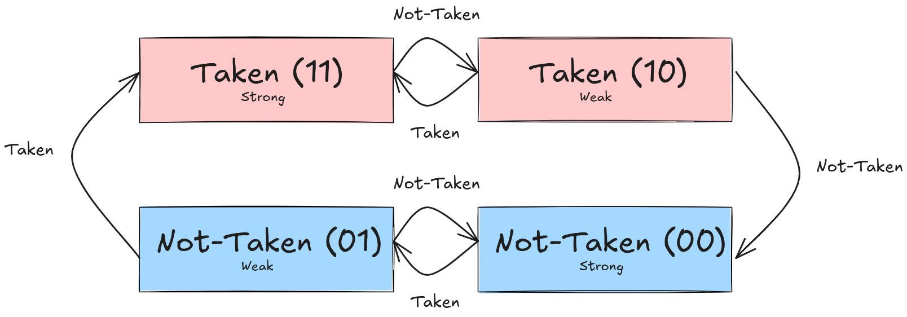

1. Explicar predictor de dos bits, Incluir diagrama y transiciones de estado
	- El predictor de dos bits es una extensión del predictor de 1 bit, el cual determina si predecir la toma del branch o no (se suelen llamar taken o not-taken), la diferencia radica en la flexibilidad adicional del de 2 bits, ya que el primero siempre toma la decisión (de predicción) según el salto anterior (dado que si fue taken se pondrá 1 sino 0), al agregar un bit más tenemos que el predictor tiene cierta tolerancia respecto a la predicción, por lo que situaciones como loops anidados pueden tener mayor accuracy o situaciones TNTNTNT, el de dos bits tiene un accuracy de 50% mientras que el de 1 bit 0%.
---
2. ¿Cuáles son las distintas políticas de escritura de cache? Explicar cada una, comparándolas según el uso de procesador, y el uso del bus.
	- Existen 2 tipos de escrituras 
		- Write-Through: Esta política tiene como característica principal que mantiene siempre coherente el cache con la memoria principal por lo que el dato que se encuentre en la cache siempre coincidirá con el de la memoria, esto implica que cada escritura que se haga sobre una línea del cache tiene que también escribirse (y bajar en la jerarquía) a la memoria, lo que hace que el bus esté siendo accedido y ocupado mucho tiempo
		- Write-Back (copy-back): Esta política tiene como característica principal que mantiene los datos escritos en la memoria cache hasta que la línea tenga que ser desalojada, en ese momento hace la escritura al nivel inferior de la jerarquía, lo que hace que programas que requieran gran cantidad de escritura no estén accediendo al bus en todo momento (también se implementa en la línea cache el bit de dirty para saber si la línea fue modificada en el cache, en el que caso de que no lo sea no es necesaria la escritura a memoria), notar que este tipo de escrituras son muy rápidas (a velocidad cache)
---
3. En el protocolo MESI, el controlador de cache tiene una línea de memoria en estado S, y el procesador correspondiente emite una orden de escritura. Detallar los mensajes y líneas involucradas en el protocolo de handshake, y explicar cómo son afectadas las controladoras de cache.
	- En ese caso se tiene que hacer lo siguiente
		- Se activa RFO (Request For Ownership) para invalidar las lineas que tengan esta línea en SHARED, ya que se va a hacer una escritura y dichas líneas quedarán incoherentes con la memoria principal y con la línea escrita
		- La línea se escribe (ya teniendo el Ownership) y la misma pasa a estado MODIFIED
---
4. ¿Qué hazards surgen de implementar ejecución fuera de orden? Detallar con ejemplos.
	- Surgen los siguientes hazards
		- RAW (Read, After Write): Este hazard es de dependencia de datos, es decir una instrucción tiene que leer un operando que tiene una instrucción previa que escribe en el mismo, por lo que dicha instrucción (para mantener la lógica del programa) deberá esperar dicha escritura , ej `MOV RAX, [RSI]` y luego un `add RAX, R8`, el riesgo sería que lea el operando RAX antes de que sea escrito por la instrucción previa (que no ha sido ejecutada)
		- WAW (Write, After Write): Este hazard hace que las escrituras estén en orden incorrecto lo que rompe la lógica del programa, es decir la instrucción posterior escribe sobre algún registro y en una instrucción previa se escribe el mismo, lo que hace que cambie su correctitud, ej: `add RAX, R10` y `xor RAX,R10`, el riesgo sería que se ejecute el xor primero haciendo (en este ejemplo) que RAX valga algún valor diferente para que la instrucción previa lo use, llevando a incoherencia respecto del programa
		- WAR (Write, After Read): Este hazards sucede cuando en una instrucción posterior se escriba un valor que luego se lee en una instrucción previa, ej `add R10, RAX` y posteriormente `xor RAX, RAX`, en este caso RAX podría primero tener el valor 0 y esto se usaría en el primer add lo que cual no sigue la lógica del programa
---
5. ¿Cuáles de esos riesgos son solucionados por el approach de tomasulo?
	- Tomasulo soluciona los riesgos WAW y WAR, mientras que los riesgos RAW son minimizados, ya que si una instrucción tarda mucho más que la posterior y la posterior necesita un dato escrito por la que tarda es obligatorio que tenga que esperar para ejecutar dicha instrucción
---
1. Explicar los recursos que brinda tomasulo para permitir OoOE y prevenir los riesgos, y su funcionamiento.
	- La idea de Tomasulo se basa en renombrar los registros para solucionar dependencias (toma cada registro físico y le asigna un tag -la estructura que los relaciona se la conoce como Register Alias Table (RAT)) y luego usar dichos renombres en otra estructura llamada Reservation Stations (RS), la cual tiene la instrucción a ejecutar (que aún no tenga los operandos listos) y un lugar para los operandos, dicha instrucción no se envía a ejecución hasta que ambos operandos estén listos, cuando una operación se completa el Common Data Bus (CDB) se usa para broadcastear el valor a todas las RS que tienen dicho tag esperando por valor, cuando los valores de los registros son válidos (es decir no necesitan ser producidos) el tag se torna irrelevante
	- Notar que los renombres eliminan las hazards tipo WAW y WAR al no cruzarse los registros y al usar el tag para esperar los valores producidos
	- Y la parte de la RS hace que las instrucciones tengan que esperar a la producción de sus operandos, así no usa valores que no son válidos aún, minimizando los RAW, ya que al broadcastear el valor puede ejecutar la operación sin esperar que la escritura se complete