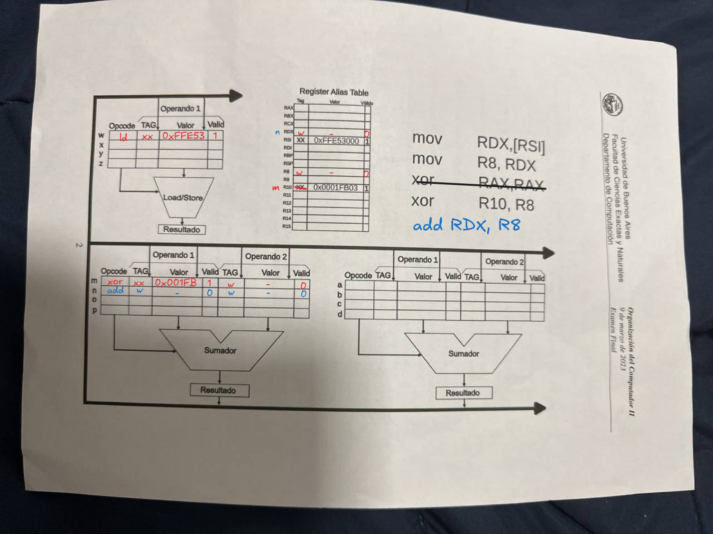

# Memoria
Se tiene un sistema SMP. Cada procesador tiene su propio controlador caché. Utiliza para mantener coherentes los sub sistemas de memoria caché y la DRAM el protocolo MESI.
1) ¿Cuál es el recurso de hardware mediante le cual cada Controlador Cache detecta las transacciones que los demás Cores cursan con la memoria del sistema (DRAM)? Indicar el nombre del recurso, y a qué líneas del bus se conecta.
	- El snoop bus, el mismo se conecta desde el bus de sistema a cada controlador cache (uno por cada), este "espía" lo que hacen los demás procesadores al leer la dirección (del bus de sistema) y la acción requerida (desde el bus de control), si es un hit se resuelve desde el que la detectó y activa el protocolo de coherencia, sino sigue en su proceso normal.
2) Explicar si S es un estado preciso o impreciso. Justificar.
	- Shared es un estado impreciso, el cache no sabe si los demás de lineas invalidan dicha línea o cuantos realmente tienen la línea
3) ¿Cuál es la política de escritura que tiene el Controlador Caché con una línea en estado M? Explicar cuál es, las ventajas de la misma, y el Ownership de una línea en estado M.
	- La escritura de una línea modified consiste en escribir esta línea sin tener que informar sobre el cambio, sigue en estado modified (ya que tiene el Ownership de la línea), la línea está incoherente con memoria (**write-back**), por lo que cuando es desalojada se tiene que escribir en memoria (esto hace que el bus tenga menos accesos para escribir a memoria)
4) Explicar qué pasa si una caché intenta leer de memoria una línea que otra tiene en estado M. Qué líneas de control se activan, cuál es el proceso, y en qué estado queda la línea en ambas cachés luego de la lectura.
	- Se sigue el siguiente proceso
		1. La línea que tiene la línea en modified inicia RFO (request for ownership), para marcar que la línea está incoherente
		2. Hace write-back de esta línea y el cache que requiere la línea toma su valor desde el bus, y la misma pasa a **Exclusive**
		3. Si terminan la operación ambas pasarán a **Shared**
---
# Tomasulo
1) Se tiene el siguiente código, con los registros R10 y RSI con valores válidos ya cargados. Hay que completar el diagrama usual, poniendo los valores apropiados en las Reservation Station y la RAT. :
```
1. mov RAX, [RSI]
2. mov R8, RAX
3. xor R10, R8
```



2) Explicar cuáles son los hazards de datos presentes en el código, y cómo se resuelven
	- Existe una dependencia RAW, debido a que primero debe conseguir el valor de RAX proveniente de la dirección guardada en RSI, se resuelve mediante Stalling
	- Misma situación con R8 en la instrucción 2 y 3

3) Llega la siguiente instrucción luego de las mencionadas anteriormente: add RAX, R8. Agregar la instrucción a la Reservation Station que corresponda, explicar en qué cambia en la RAT, señalar los hazards que agrega esta instrucción y cómo el algoritmo de Tomasulo los resuelve.
	- La instrucción tiene dependencia de datos referida en la primera instrucción, Tomasulo resuelve esto usando el tag anterior para cuando se broadcastee el valor, ingrese a la RS (notar que R8 también refiere al mismo Tag) ❓ --> *Está bien esto?*