# Instruction Level Parallelism

En la maquina de ejecución (ciclo fetch-decode-execute) se ejecutaba un ciclo se clock por cada etapa de la misma

*Pipeline,* arquitectura que permite crear el efecto de superponer en el tiempo, la ejecución de varias instrucción a la vez. Se logra si todos los bloques funcionales trabajan en paralelo pero cada uno en una instrucción diferente, cada parte se denomina *stage*.
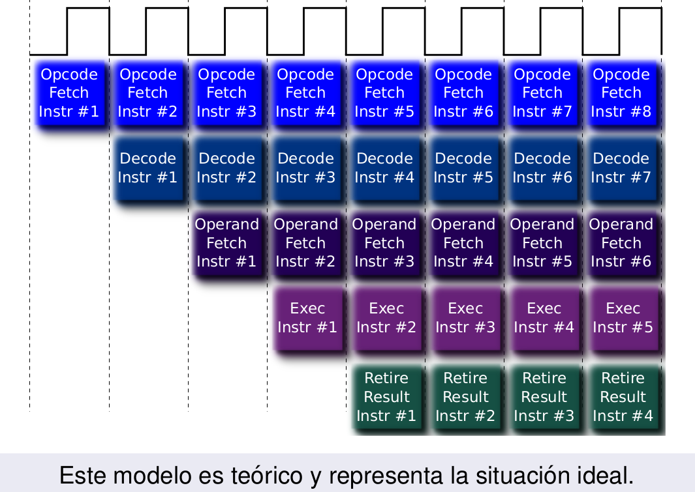

**Nota:** No reduce el tiempo de ejecución o cada instrucción, solo incrementa el número de instrucciones completadas por unidad de tiempo.

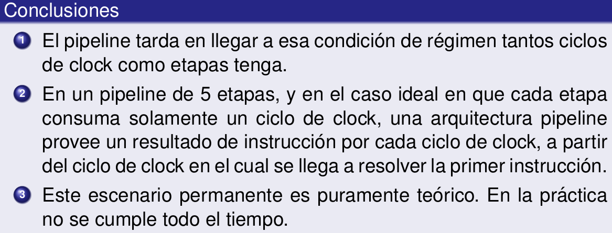

Para qué aumentar el número de etapas?
Para un tiempo ya establecido de procesamiento interno de una instrucción para una arquitectura “no pipelinezada“, intuitivamente puede comprenderse que en principio cuantas mas etapas podamos definir para ejecutar esta operación, al ponerlas a trabajar a todas en paralelo en un pipeline, el tiempo de ejecución de la instrucción se reducirá proporcionalmente con la cantidad de etapas.
$$TPI = \frac{Tiempo \ por \ instruccion \ en \ la\  CPU \ (No-Pipeline)}{Cantidad \  de\  etapas}$$

TPI: Time Per Instruction

## Hazards (Obstáculos)

Los podemos categorizar en obstáculos
1. estructurales
2. de datos
3. de control

Generan **pipeline stall**

### **Obstáculos estructurales**

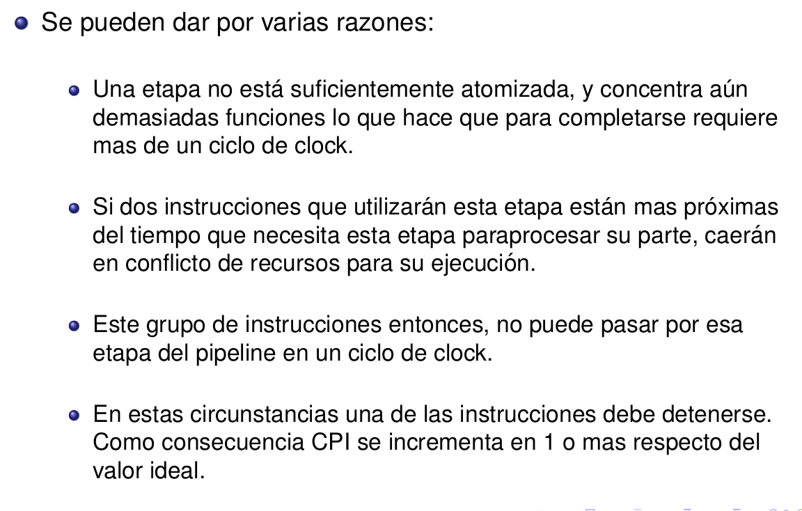

Ej: Accesos concurrentes a memoria

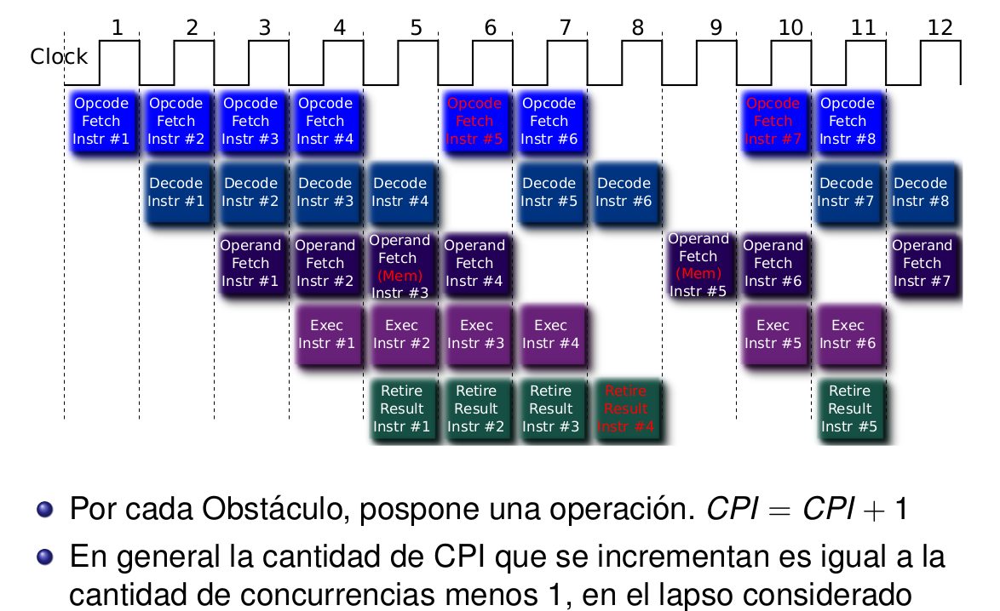

Posibles soluciones
- Desdoblamiento del cache L1 (datos y código)
- Buffers de instrucciones como FIFO
- Ensanchamiento de los buses (más que el ancho de palabra)

### **Obstáculos de datos**

Se produce cando una instrucción requiere de un dato antes de que esté disponible por efecto de la secuencia lógica prevista en el programa

Ej: 

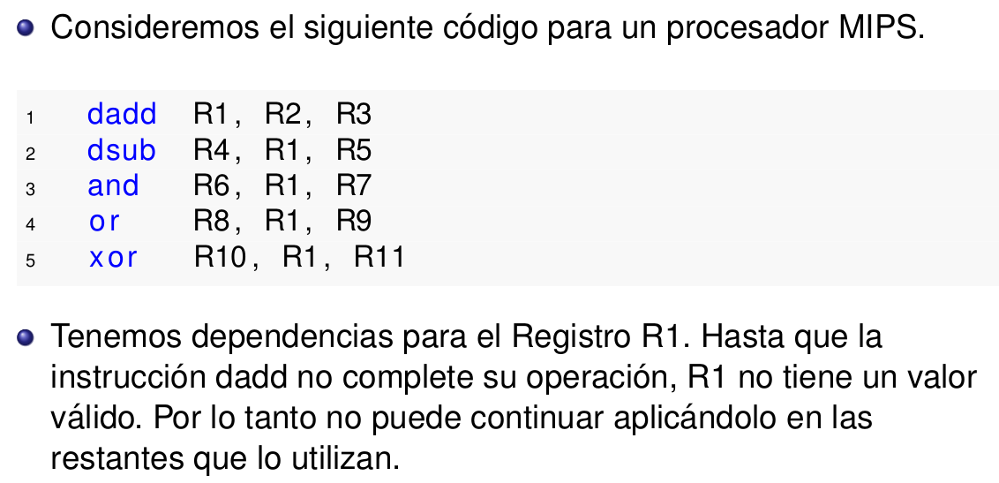

En el pipeline,

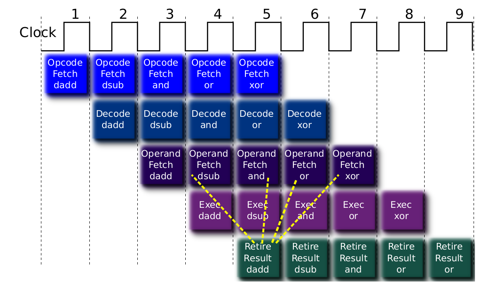
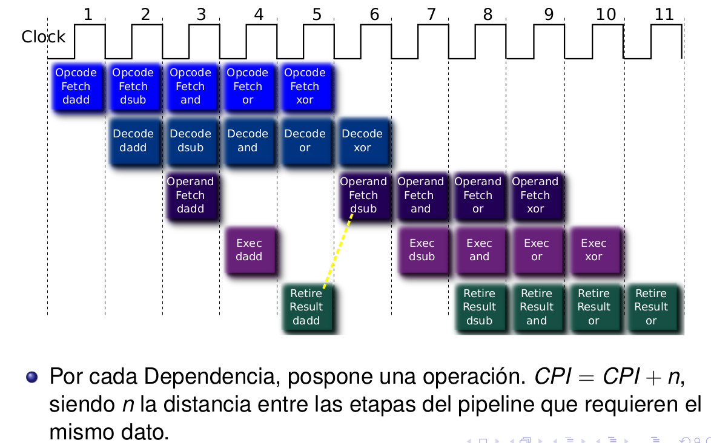

- En general, CPI = CPI + n, siendo n la distancia entre las etapas del pipeline que dependen entre sí.

Posibles soluciones
- Forwarding: Se extrae el resultado directamente de la salida de la unidad de Ejecución (ALU, Floating Point, o la que corresponda a la instrucción), cuando está disponible y se lo envía a la entrada de la etapa que lo requiere en el mismo ciclo de clock en que se escribe en el operando destino. Esto permite disponer del dato en la siguiente instrucción ahorrando en la espera el tiempo de escritura en el operando destino, sin que ésta deba esperar que se retire el resultado (es decir que se aplique en el operando destino).

### **Obstáculos de control**
Un branch es la peor situación en pérdida de performance, ya que es una discontinuidad en el flujo de ejecución.

Esto hace que todo lo pre-procesado deba descartarse, y el pipeline se vacía debiendo transcurrir $n-1$ ciclos de clock para el próximo resultado, siendo $n$ la cantidad de etapas del pipeline, se conoce como **Branch penalty**

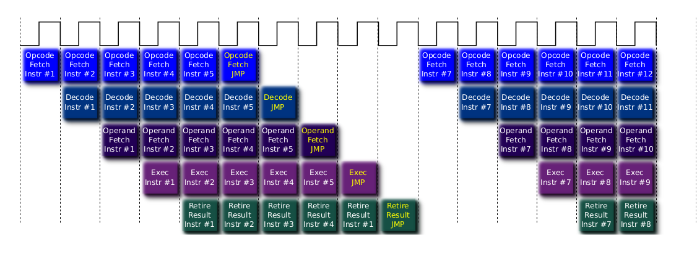

- Igual pasa con las interrupciones

En los branch condicionales tenemos los términos,
- Branch taken si la condición true y se hace el salto 
- Branch untaken en el otro caso

*Cómo podemos determinar si es branch taken?*

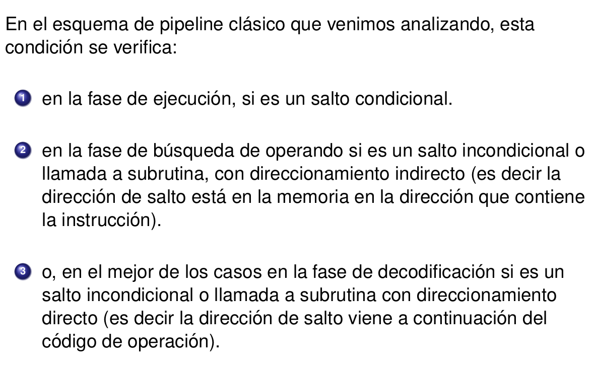

Posibles soluciones
- Forwarding podría ayudar a disminuir el efecto
- Predicción de saltos

## Unidades de predicción de saltos

Sabemos que si tenemos más etapas el branch penalty es mayor, por lo que es esencial lograr una correcta predicción de saltos.

Hay varias alternativas para hacer esto,
- predicted-non-taken: el procesador asume siempre branch untaken, cuando el salto es "hacia adelante" es útil
- predicted-taken: el procesador asume siempre branch taken, por lo que se busca el código de operación de las instrucciones a partir del target, funciona muy bien para iteraciones (más eficiente que la anterior)
- delayed branch: la instrucción sucesora secuencial se envía al slot de salto demorado, siempre se ejecuta y se aplicará según el resultado de la condición del branch, en caso de que sea taken se descarta y se tiene un ciclo de clock para que salga el resultado de la instrucción destino
- loop unrolling en el compilador, hacer en forma secuencia los loop

### **Predicción de saltos dinámica**

El procesador comienza a efectuar un análisis del flujo del programa y toma decisiones en función de lo que encuentra se tiene un paso adelante en la predicción de saltos.

#### **Branch Prediction Buffer**

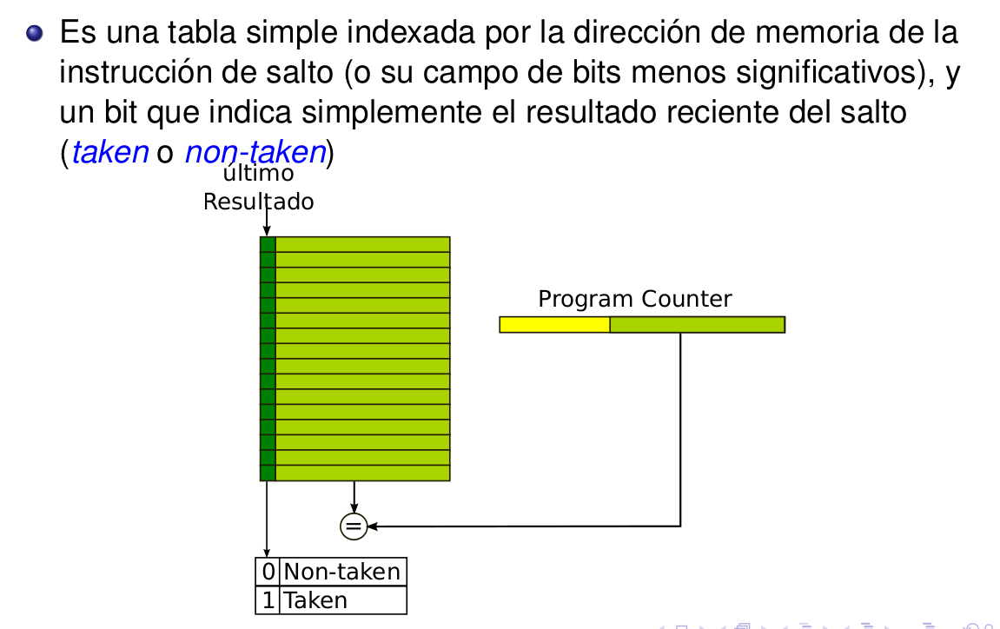

- El bit da una pista sobre qué acción tomar (se suele llamar predicción simple a de 1 bit)
- Si el salto sempre resulta taken, y falla una vez produce dos predicciones fallidas seguidas, ya que el bit se invierte
- Tener un solo bit limita la efieiecia, por ejemplo si hay taken y non-taken seguidos, o cuando se tienen loops anidados

Predicción de 2 bits, la idea es que no se va a cambiar la predicción al primer desacierto, sino que al segundo, se definen los siguientes estados

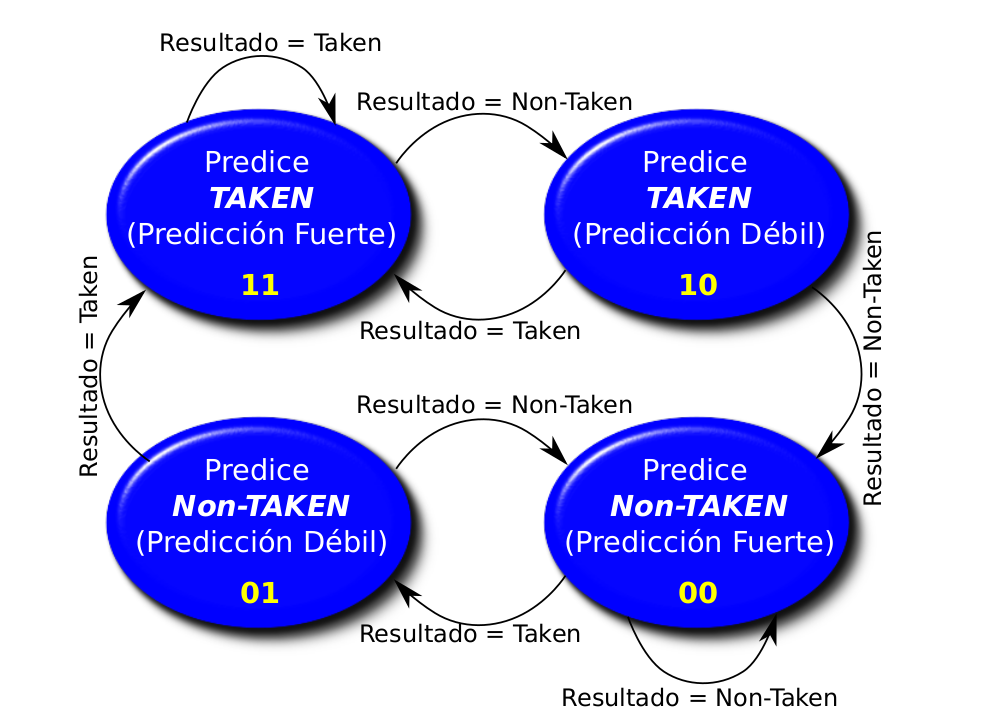

-  En la practica, este tipo de Branch Predictor se implementa en la etapa de Fetch del pipeline (para no perder tiempo), y se utiliza un pequeño cache de direcciones de salto accesible mediante las direcciones de las instrucciones (como vimos para el caso de 1 bit). También se puede implementar agregando un par de bits a cada bloque de lineas en el cache de instrucciones que se emplean únicamente si ese bloque tiene instrucciones de salto condicional.

#### **Branch Target Buffer**

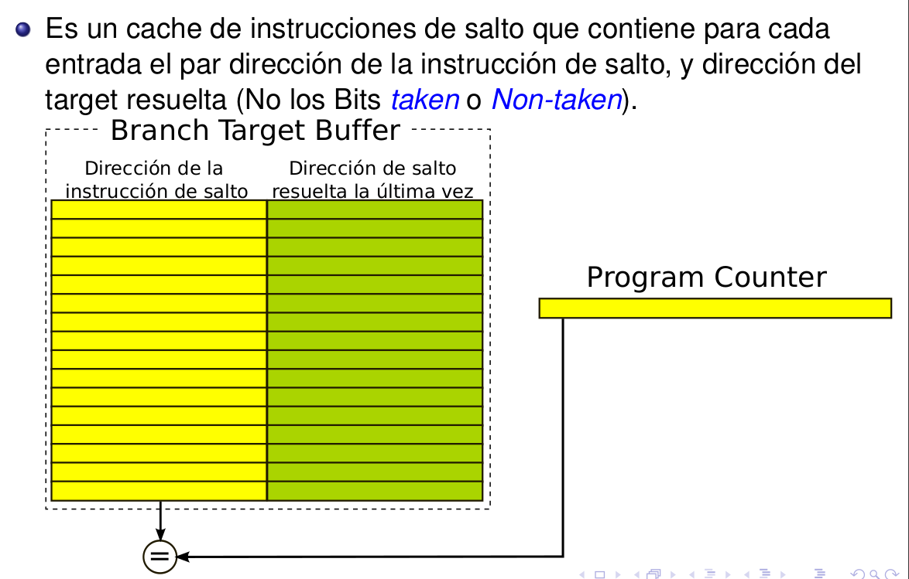

- Si el valor no se encuentra se asume taken
	- Si el resultado es non-taken se acepta el delay y no se guarda la dirección en BTB
	- Si el resultado es efectivamente taken, se ingresa el valor en la BTB
- Si el valor se encentra en el BTB, se aplica el campo de dirección de campo almacenado
	- Si el resultado es taken no hay penalidad y no se guarda ningún nuevo valor
	- Si el resultado es non-taken guarda el nuevo valor en la BTB, luego de la penalidad

## Superscalar

Idea: Paralelizar pipeline, tiene dos unidades de cada stage, de manera tal que podemos mandar una instrucción a cada una (Pentium primero)

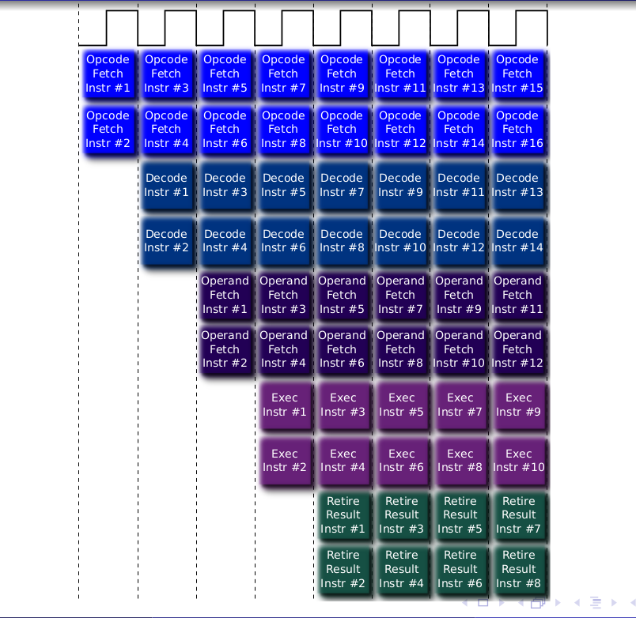

Más paralelismo, más obstáculos estructurales y de datos, además los branch penalties son dobles en consecuencia

## Scheduling dinámico

Hasta el momento se veían scheduling estático, simplemente los pipelines buscan una instrucción y la envían a la unidad de ejecución, en caso de superescalares el estudio de dependencias se debe extender a instrucciones en los diferentes pipelines.

Hasta ahora, si una instrucción $j$ depende de una instrucción $i$, y la instrucción $i$ requiere de varios ciclos de clock para completarse (debido a obstáculos), entonces la instrucción $j$ y todas las instrucciones sucesoras no pueden ser ejecutadas y, por lo tanto, tenemos un Pipeline *stall*. Esta obstrucción del pipeline deja completamente inutilizado a todas las unidades funcionales que compongan a la Unidad de Ejecución de todos los pipelines.

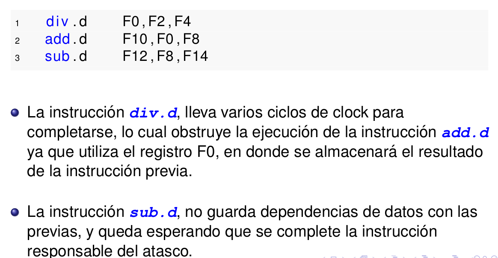

---
# Ejecución Fuera de Orden

Tratar de enviar las instrucciones a ejecución independientemente del orden que están, nuestro decodificador nos indicará si se presenta algún atasco dónde podemos intentar aplicar este método.

Hay riesgos ❌

**Ojo**: La aplicación de los resultados va en orden, sino, estaríamos cambiando completamente la lógica del programa ❕

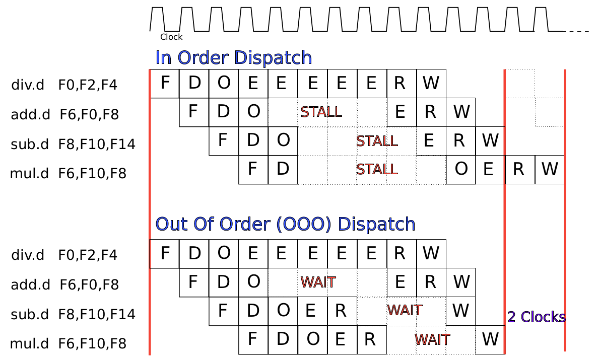

Obs:
1. La instrucción 3 escribe su resultado en un operando de la instrucción 2
2. La instrucción 4 escribe su resultado en un operando de la instrucción 2

 - **WAR**: Este riesgo se llama **Write, After Read**, se obtiene al leer un dato incorrecto, ya que fue escrito fuera de orden 

- **WAW**:Otro riesgo es **Write, After Write**, se obtiene al escribir un dato que fue escrito por una instrucción posterior, alterando la ejecución

- **RAW**:Por último tenemos el **Read, After Write**, se obtiene cada vez que una instrucción posterior lee un operando que después es escrito por una instrucción previa, este riesgo existe desde que implementamos *pipeline*, generalmente aparece un pipeline stall

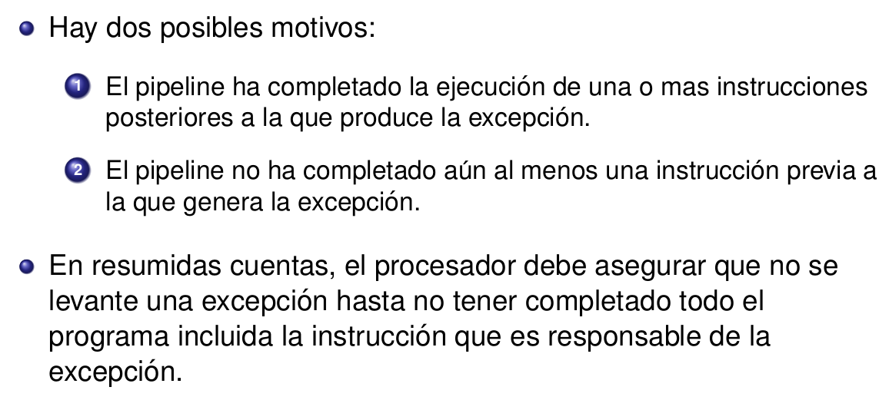

El algoritmo de Tomasulo surge para resolver los límites que tenía Scoreboarding

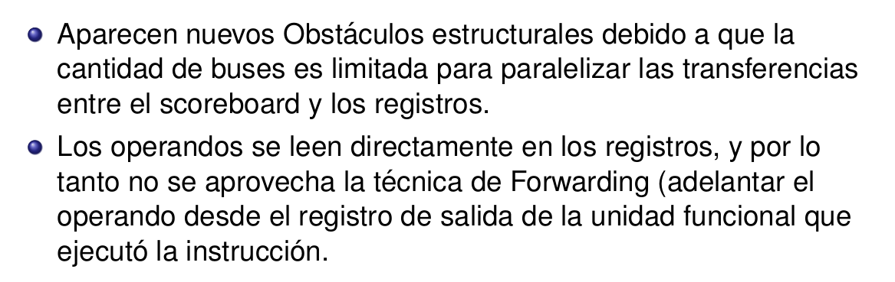

---

## Algoritmo de Tomasulo (1967)

*Objetivo*: Minimizar riesgos RAW, e implementar Register Renaming en los WAR y WAW para neutralizarlos

Qué necesita un procesador para implementar Ejecución Fuera de Orden?

1. Mantener un “link” entre el productor de un dato con su(s) consumidor(es)
2. Mantener las instrucciones en espera hasta que estén listas para ejecución
3. Las instrucciones deben saber cuando sus operandos están “Ready”
4. Despachar (“disparar”) la instrucción a su Unidad Funcional ni bien todos sus operandos estén “Ready”.

---
### **Mantener un “link”entre el productor de un dato con su(s) consumidor(es)**

Para esto se usa *Register Renaming*, este método permite asociar un "tag" con cada operando

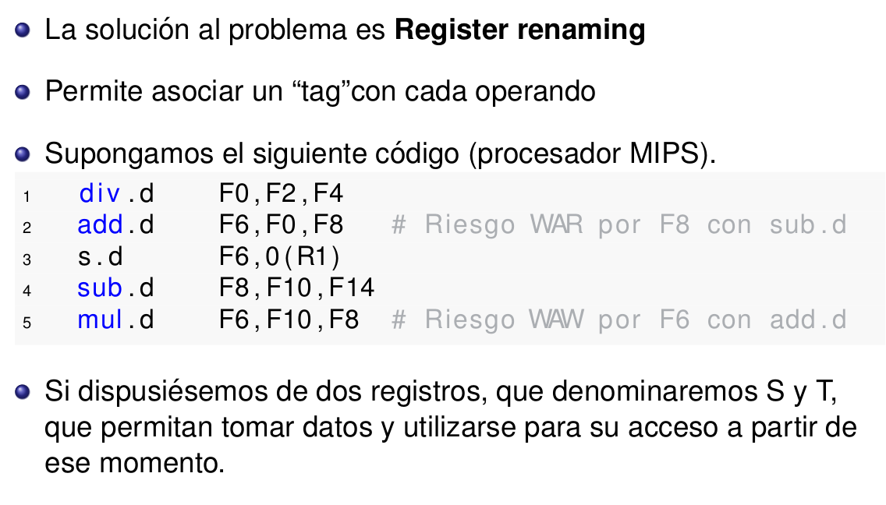
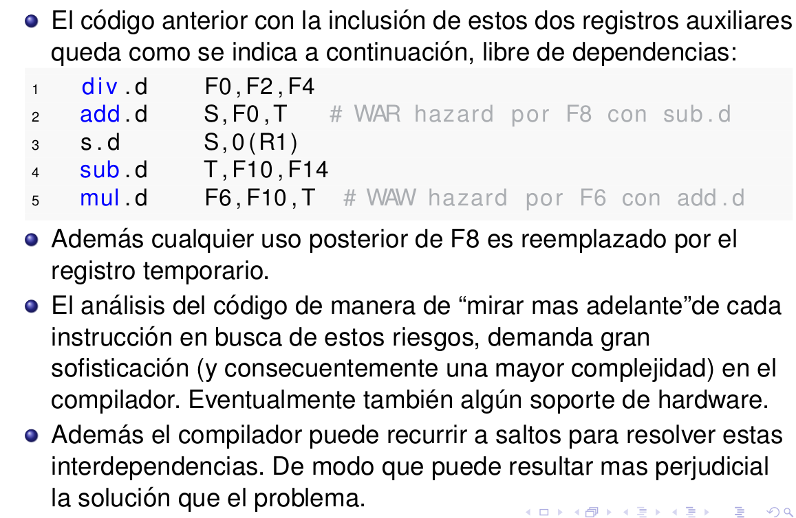

Consiste en la Register Alias Table

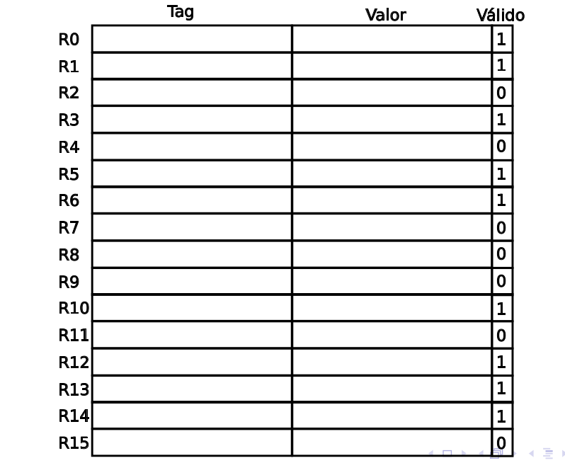

Una entrada por cada registro (físico) cada una con un campo 
- Tag: El renombre del registro (se marca no valido)
- Valor: Valor de dicho registro
- Valid: Si es válido o no el valor

### **Reservation Station**

Es un buffer donde se reservan las instrucciones que no están READY, deberían estar en ejecución pero les falta algún operando (u otra razón).

Los operandos tendrán la misma estructura que la RAT, cuando todos los operandos de una instrucción tengan valid activado, entonces la instrucción está READY.

Cada vez que una Unidad de ejecución pone disponible un operando, es decir, cada vez que termina de ejecutar una instrucción, ese operando es un valor que va a ser consumido por otras instrucciones que se encuentran en la Reservation Station. O sea, ahora ese valor está asociado a un tag, porque como ese registro no tenia un valor valido, estaba renombrado con un tag. Entonces, ahora esa unidad de ejecución deberá informar a todo el sistema diciendo: ”este tag ahora tiene este valor”. Luego, todos los que tengan ese tag lo van a reemplazar con ese valor y van a marcar a ese operando como Ready. Es decir, pisan el valor, dejan el tag y ponen en 1 el bit de validez. Ahora, como el bit de validez está en 1, la lógica no va a mirar el tag, va a mirar el valor.

- Si un operando destine recibe multiples escrituras la RS solo aplicará la última

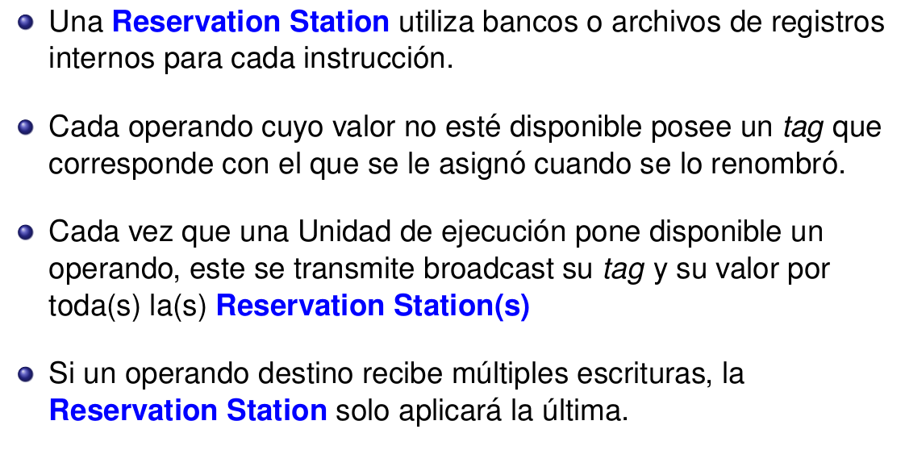

Cuando una instrucción tiene todos sus operandos la RS la dispara o Despacha a la Unidad Funcional correspondiente

- Si la RS es muy grande a comparación de los registros se puede eliminar los riesgos estudiados

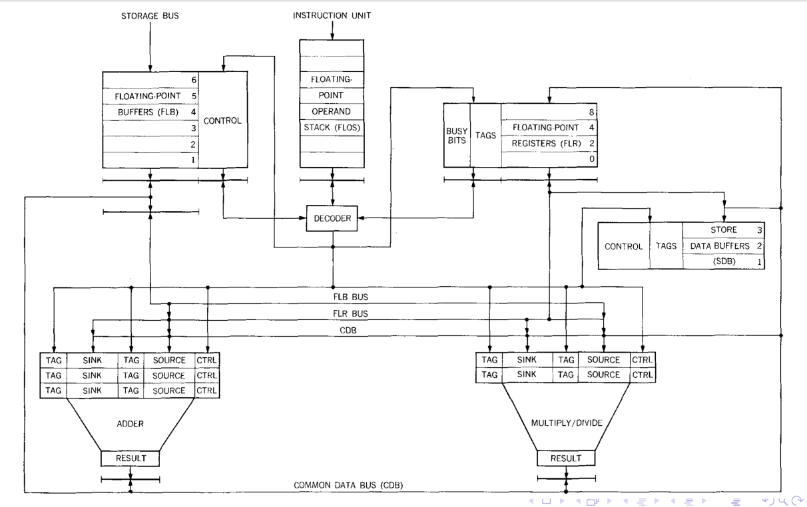

El CDB resulta crucial para el broadcast de los resultados. En particular, cruza la salida de las unidad funcionales y atraviesa las Reservation Station, los Floating Point Buffers, los Floating Point
Registers y el Floating Point Operations Stack.

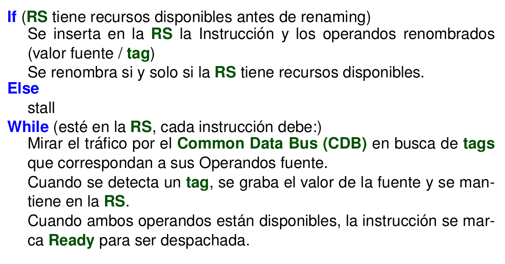
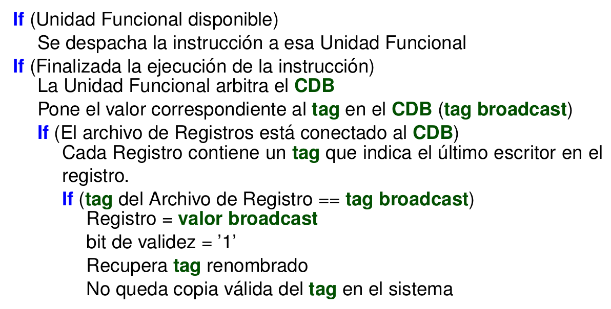

## Predicción de saltos más sofisticada

- En general ejecución especulativa es la capacidad de una arquitectura para ejecutar instrucciones sin tener aún los resultados de sus dependencias, sino simplemente asumiendo que el resultado será uno determinado, y lo mas importante, tener la capacidad de deshacer la operación si la especulación no fue correcta.
- Una vez que se tiene el resultado la instrucción deja de ser especulativa y con esta certeza está en condiciones de escribir en el registro destino.
- Este tipo de ejecución especulativa hace que se tengan pre almacenados resultados de instrucciones posteriores que luego deben impactarse en sus operandos destino
- El commit de los resultados debe hacerse en orden ❗
- Esta es la función del **ReOrder Buffer (ROB)**.
- Igual que la Reservation Station de Tomasulo, el ReOrder Buffer agrega registros en los cuales se van almacenando los resultados  de las instrucciones ejecutadas en base a especulación por hardware.
- El resultado permanecerá en el ROB desde que se obtenga el resultado hasta que se copie (commit) en el operando destino.
- La diferencia con el algoritmo de Tomasulo, es que éste ponı́a el resultado en registro directamente, y a partir de entonces el resto de las instrucciones lo tenı́a disponible. El ROB no lo escribe, sino hasta el commit. Y durante ese lapso que al especular se puede extender, el registro de la arquitectura no tiene el valor.

**Ej:** Si la ventana tiene 8 instrucciones, y de esas 8 la primera no está lista, pero esta lista la segunda y la tercera, no aplicamos nada, porque la primera no esta lista y los resultados deben aplicarse en **orden**. Ahora, en cuanto la lógica nos marca como válida la primer instrucción, como la segunda y la tercera ya las tenemos listas, aplicamos las tres, y corremos la ventana tres lugares para abajo (así sucesivamente)

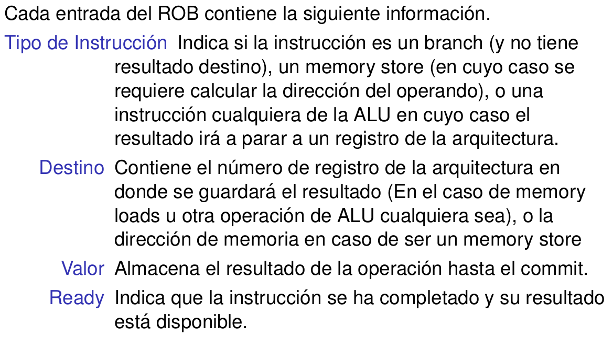

Su implementación es la siguiente:

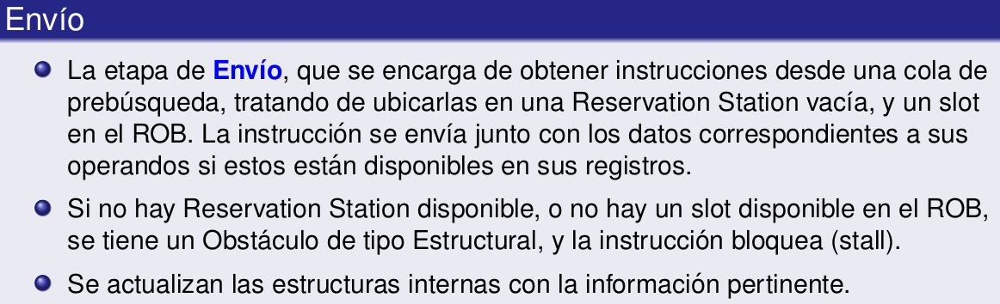
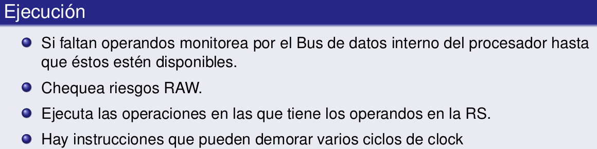
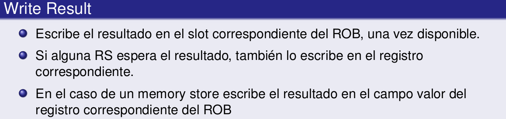
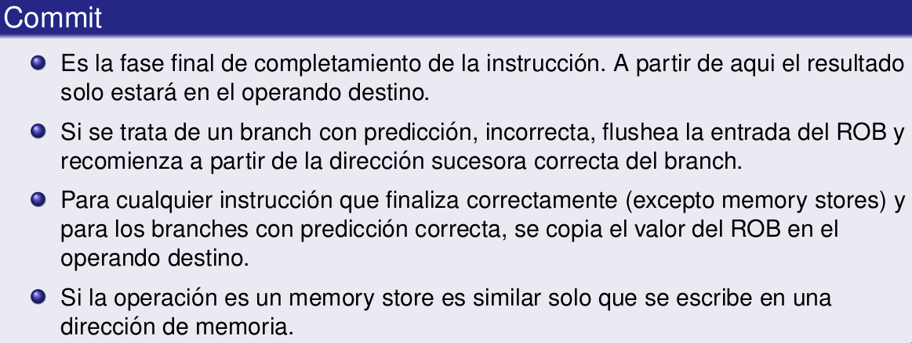

## Three Cores Engine

Caso práctico

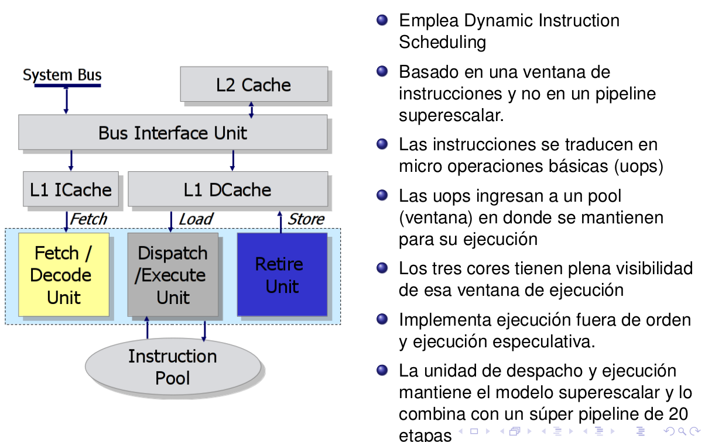
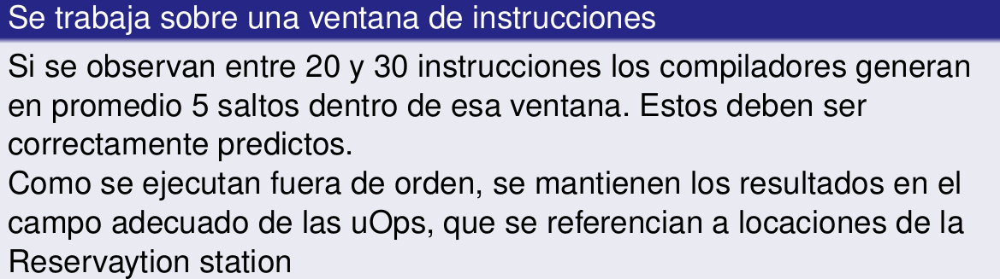
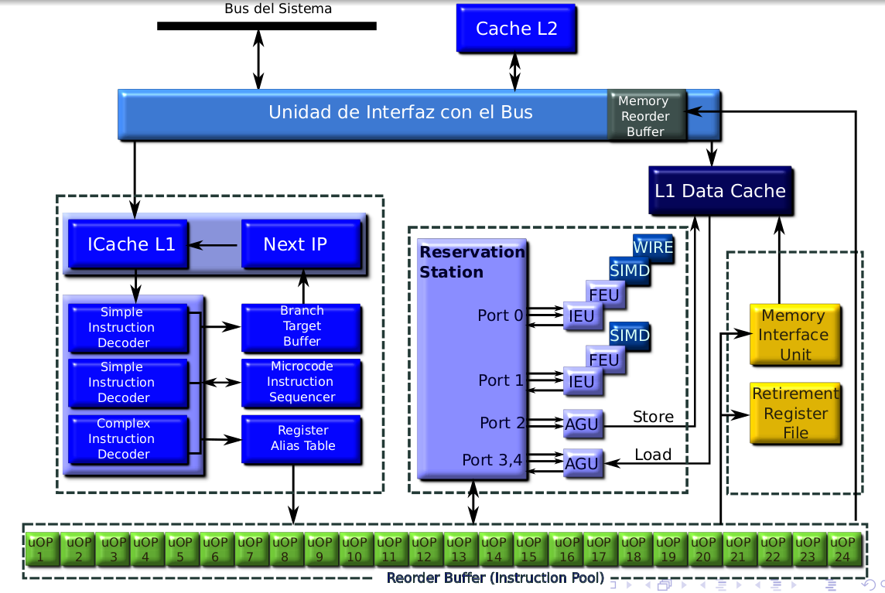
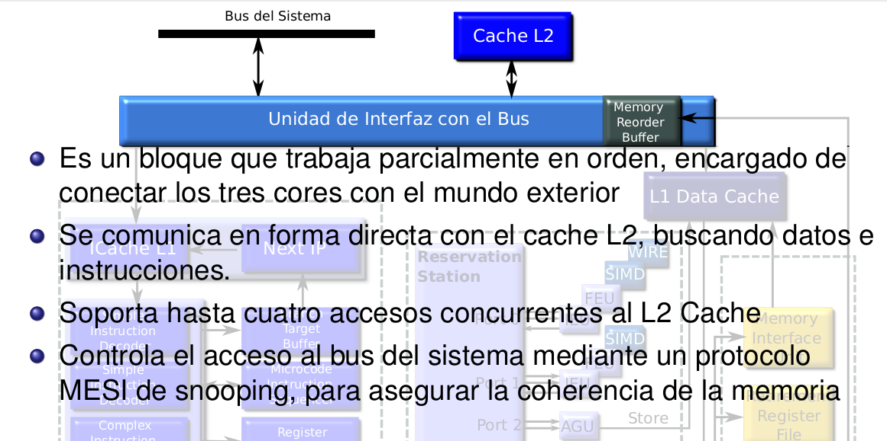
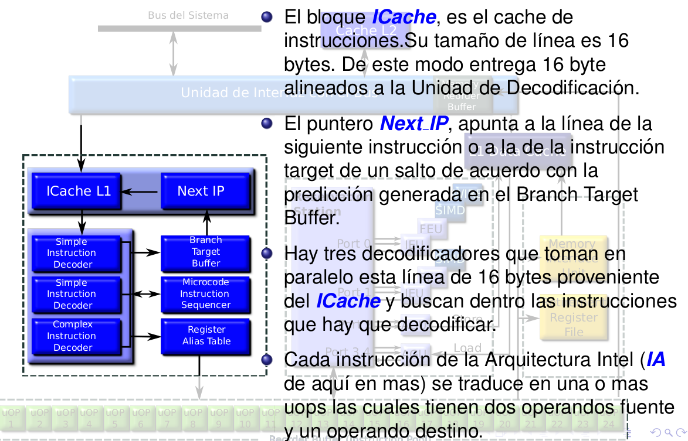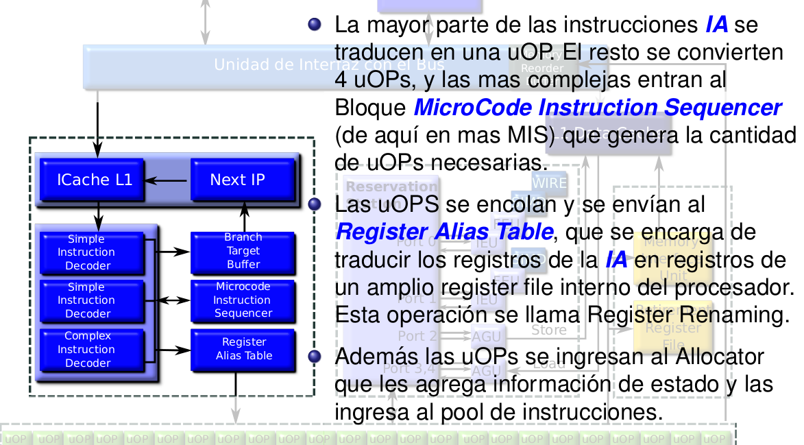

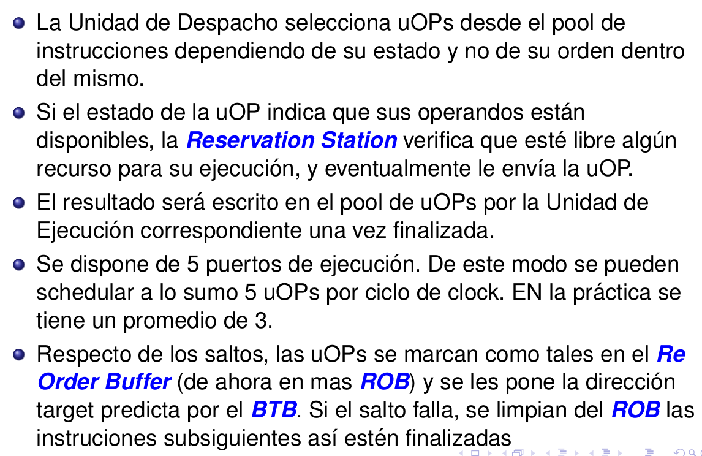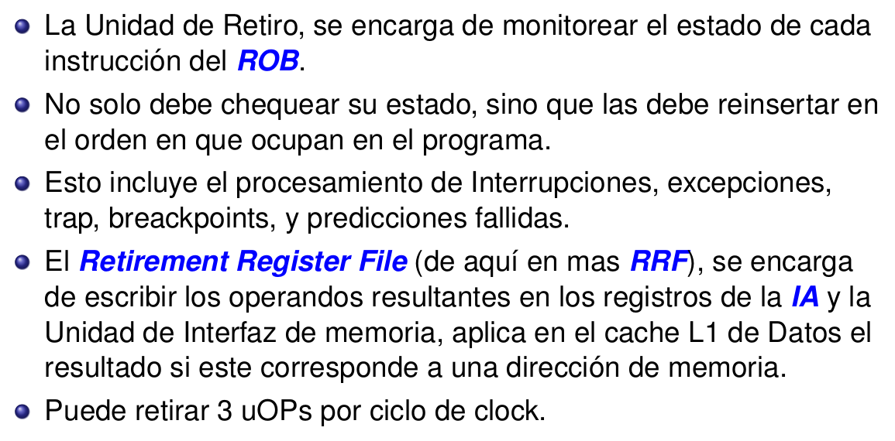